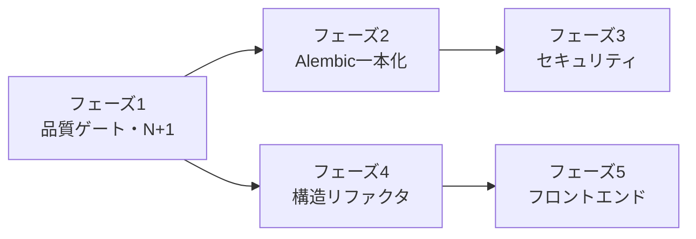

# アーキテクチャ改善プラン（2026-07-05）

[architecture-review-2026-07-05.md](architecture-review-2026-07-05.md) の課題を、依存関係と費用対効果を踏まえて 4 フェーズに分けた改善プランである。各項目にレビューの課題 ID を併記する。

## 方針

- **挙動を変えない構造改善を先行**させ、各フェーズ末尾で既存テスト（pytest / Vitest / Playwright）が全て通ることをゲートとする。
- セキュリティ改善（暗号化・TLS 検証）は **既存環境の後方互換**（既存 DB・自己署名証明書環境）を壊さない opt-in / 自動移行方式とする。
- 1 項目 = 1 PR を原則とし、レビュー可能な粒度を保つ。

---

## フェーズ 1: 品質ゲートと即効性の高い修正（目安: 小〜中規模 PR × 4）

構造変更の前に検知網を張る。以降のフェーズの安全性が上がる。

### 1-1. CI に Python 型チェックを追加（E-1）

- `pyproject.toml` の dev グループに `mypy`（または `pyright`）を追加し、CI の `python` ジョブに組み込む。
- 初回は `--ignore-missing-imports` + 段階的厳格化（`disallow_untyped_defs` はモジュール単位で opt-in）とし、既存コードの一括修正はしない。
- 受け入れ条件: CI で型チェックが必須ジョブになる。

### 1-2. バックエンドカバレッジの CI 計測（E-2）

- `pytest --cov=vcenter_event_assistant --cov-report=xml` を CI に追加し、アーティファクトとして保存（フロントエンドと同じ方式に揃える）。

### 1-3. E2E ジョブへの paths-filter 適用（E-3）

- `frontend-unit` と同様の `dorny/paths-filter` を `e2e` に適用。バックエンド変更時は `src/**`・`tests/**` もトリガに含める（E2E はバックエンドも起動するため）。

### 1-4. 取り込みの N+1 解消（C-5）

- `services/ingestion.py` の重複確認 SELECT を、dialect の `insert(...).on_conflict_do_nothing()`（PostgreSQL / SQLite 双方で利用可）に置換する。
- 挿入件数は `rowcount` ベースで返す。既存の戻り値契約（挿入行数）を維持し、`test_perf_sampling.py` 等の既存テストで検証する。
- 受け入れ条件: イベント 1,000 件バーストの取り込みで SELECT が発行されないこと（SQL エコーまたはイベントリスナで確認するテストを追加）。

## フェーズ 2: データベース基盤の一本化（目安: 中規模 PR × 3）

### 2-1. マイグレーションを Alembic に一本化（A-1）

最重要。手順:

1. `init_db()` を「`alembic_version` テーブルの有無で分岐」する方式に変更する。
   - **新規 DB**: `create_all` の代わりに `alembic upgrade head` をプログラム的に実行（`alembic.command.upgrade`）。
   - **既存 DB（`alembic_version` なし）**: 現行スキーマに対応するリビジョンへ `alembic stamp` してから `upgrade head`。stamp 対象リビジョンの判定には、既存の `_ensure_*` 関数が見ている列の有無を利用できる。
2. 移行完了後、`_ensure_events_user_comment_column` 等の手書き列追加関数と `create_all` 呼び出しを削除する。
3. `docs/development.md` の手順を更新し、「モデル変更 = Alembic リビジョン追加のみ」というルールを明記する。

- 受け入れ条件: (a) 新規 SQLite/PostgreSQL で起動 → 全テーブル生成、(b) 旧スキーマ DB（列欠落あり）で起動 → 自動 stamp + upgrade、の両方をテストで担保（既存 `test_db_session_migrations.py` を拡張）。

### 2-2. 複合インデックスの追加（A-2）

- Alembic リビジョンとして追加（2-1 完了後なので一本化された経路に乗る）:
  - `events (vcenter_id, occurred_at)`
  - `metric_samples (vcenter_id, entity_moid, metric_key, sampled_at)`
- 追加前後で一覧系 API（`/api/events`、`/api/metrics`）の実行計画・応答時間を確認し、結果を PR に記録する。

### 2-3. 取り込みカーソルの型改善（A-3、任意）

- `IngestionState.cursor_value` を `DateTime(timezone=True)` の新列 `cursor_at` に移行（旧列は読み取り互換のため一定期間残置）。優先度は低く、2-1 の一本化が済んでいれば低コスト。

## フェーズ 3: セキュリティ強化（目安: 中規模 PR × 3）

### 3-1. vCenter パスワードの保存時暗号化(B-1)

- `VEA_SECRET_KEY`（環境変数）を鍵とした Fernet（`cryptography`）等による対称暗号化を導入する。
- 互換性: 鍵未設定時は従来どおり平文（起動時に WARNING ログ）。鍵設定時、起動マイグレーションで平文行を暗号化（プレフィックス `enc:` 等で判別）。
- 実装位置は ORM の `TypeDecorator` とし、サービス層のコードは無変更で済ませる。
- 受け入れ条件: 鍵あり/なし/ローテーション（旧鍵で復号できない場合のエラーメッセージ）のテスト。

### 3-2. TLS 証明書検証の opt-in（B-2）

- `VCenter` モデルに `verify_ssl: bool = False` 列を追加（Alembic リビジョン）し、`connect_vcenter` に伝搬する。既定 `False` で後方互換を維持。
- UI（`VCentersPanel`）にチェックボックスを追加。CA バンドル指定（`VCENTER_CA_BUNDLE` 環境変数）も併せて対応する。
- 受け入れ条件: 検証有効時に不正証明書で接続テスト API が 502 + 明確なエラーメッセージを返すこと。

### 3-3. オプションの静的 API トークン（B-3、任意）

- `VEA_API_TOKEN` 設定時のみ `/api/*` に `Authorization: Bearer` を要求するミドルウェアを追加（`/api/health` は除外）。未設定時は現状どおり。フロントエンドはリバースプロキシがヘッダを付与する運用を想定し、SPA 側の変更は最小限とする。

## フェーズ 4: 構造リファクタリング（目安: 中規模 PR × 4、挙動変更なし）

### 4-1. `services/` のドメイン別サブパッケージ化（C-2）

- 接頭辞グループをそのままサブパッケージへ移動する:
  - `services/chat/`（chat_* 8 本）、`services/digest/`（digest_* 6 本）、`services/llm/`（llm_* 7 本）、`services/alerting/`（alert_eval* 5 本 + `notification/` を統合）
- 旧パスからの re-export は行わず、import を一括更新（機械的変更のため 1 PR で完結させる）。`tests/` も同じ構造にミラーする（`tests/services/chat/` 等）。
- 受け入れ条件: 全テスト green、`git log --follow` でファイル履歴が追えること（`git mv` を使用）。

### 4-2. 設定の依存注入化（C-1）

- 一括置換はせず、境界を定める:
  - **ルート層**: FastAPI の `Depends(get_settings)` に統一（テストで `app.dependency_overrides` が使える）。
  - **サービス層**: 頻出のもの（`ingestion.py`、`digest_*`、`llm_*`）から順に `settings: Settings` を引数で受け取る形へ移行。
  - **ジョブ層**: `setup_scheduler` で解決した settings をジョブへ引き渡す。
- `get_settings()` の直接呼び出しをエントリポイント（main / scheduler / deps）近傍に限定することをゴールとする。

### 4-3. スケジューラの整理（C-4）

- クロージャジョブ（`poll_events` / `poll_perf` / `purge`）をモジュールレベル関数へ揃え、全ジョブに `coalesce=True, max_instances=1` を明示する。
- パージ間隔を設定値（`purge_interval_hours`、既定 6）に昇格する。
- vCenter ごとの取り込みを `asyncio.gather`（同時実行数を Semaphore で制限、既定 3 程度）で並行化する。失敗分離は現行の per-vCenter try/except を維持する。

### 4-4. `AlertEvaluator` の依存明示化（C-3）

- `evaluate_event_score_rule(self, rule)` 形式の自由関数を、必要な依存（session factory / renderer / channel / settings）を明示的に受け取る形へ変更するか、`AlertEvaluator` のメソッドへ戻す。ルール種別 → 評価関数のディスパッチを辞書化し、種別追加時の変更点を 1 箇所にする。

### 4-5. レガシーダイジェスト設定の廃止予告（C-6）

- `.env.example` と `docs/backend.md` に非推奨と削除予定バージョンを明記し、起動時に使用検知で WARNING ログを出す。2 リリース後に削除する。

## フェーズ 5: フロントエンド改善（目安: 中規模 PR × 3）

### 5-1. タブの URL 同期と状態保持（D-1）

- 段階 1（軽量）: `tab` / `settingsSubTab` を URL ハッシュ（`#/events` 等）と同期し、リロード・共有で再現可能にする。ルーターライブラリ導入は必須ではない。
- 段階 2: 条件レンダリングを「マウント維持 + `hidden` 属性」またはタブ設定配列（`{id, label, help, render}`）による宣言的定義へ移行し、パネル追加時の変更箇所を 1 箇所にする。状態保持はまず利用頻度の高い EventsPanel のフィルタから適用する。

### 5-2. エラー表示のパネル局所化（D-2）

- `onError={setErr}` のグローバルバナーを、パネル内エラー領域（`PanelErrorBoundary` に非例外エラー表示を統合）へ移行する。App レベルのバナーはアプリ全体に関わるもの（設定取得失敗など）に限定する。

### 5-3. ヘルプ文言の一元化（D-3）

- `HELP_CONTENT` を `docs/user-guides/` の抜粋から生成するか、少なくとも各エントリに対応するユーザーガイドへのリンクを持たせ、二重管理の乖離を検知しやすくする。

---

## 実施順序と依存関係

- フェーズ 2 はフェーズ 3（列追加を伴う 3-1, 3-2）の前提となる。
- フェーズ 4 と 5 は独立して進められるが、型チェック（1-1）導入後に行うことで安全性が上がる。
- 各 PR の受け入れ条件は「既存テスト全 green + 当該項目の追加テスト」。

## 優先度まとめ

| 優先 | 項目 | 理由 |
| --- | --- | --- |
| 1 | 2-1 Alembic 一本化 | 放置するほど移行コストが増える |
| 2 | 1-4 N+1 解消 | 障害時（イベントバースト）の実害が直接減る |
| 3 | 3-1 / 3-2 セキュリティ | 本番運用の前提条件 |
| 4 | 1-1 型チェック | 以降の全リファクタの安全網 |
| 5 | 4-1 services 分割 | 開発速度の維持 |
| 6 | 5-1 タブ URL 同期 | UX と保守性の双方に効く |

---

## Grilling 決定事項（2026-07-05）

`/grilling` セッションで確定した方針。以降の PR は本節を優先する（本文と矛盾する場合は本節が正）。

| 論点 | 決定 |
| --- | --- |
| **最初の PR** | フェーズ 1 を **1-1 → 1-2 → 1-3 → 1-4** の順に一括で進める（優先度表の 2-1 先行は採用しない） |
| **運用形態** | **Docker + リバースプロキシ認証**（README 想定の本番相当） |
| **2-1 既存 DB の stamp** | 列判定が曖昧なら **起動 abort**。既存 DB アップグレード前は **DB バックアップ必須**（ドキュメント・手順にも明記） |
| **3-1 `VEA_SECRET_KEY` 未設定** | プランどおり **平文継続 + WARNING**（fail-closed は採用しない。docker-proxy でも鍵必須起動は行わない） |
| **3-3 API トークン** | **保留**（他項目完了後に再判断。現時点では実装しない） |
| **1-3 E2E paths-filter** | `src/**`・`tests/**` 変更時も E2E を実行。**main への push では常に E2E** |
| **フェーズ 4 / 5** | **2 → 3 → 4 → 5** の直列（並行・5 先行は採用しない） |
| **3-2 TLS 検証 UX** | DB 既定 `False` 維持。接続テスト成功時に **「本番では SSL 検証 ON を推奨」** を UI 表示 |
| **進捗管理** | 各項目を **GitHub Issue** に起票し、PR で close（**全項目を今すぐ起票**） |
| **1-4 N+1 テスト** | 1,000 件バースト + SELECT 非発行テストを **CI python ジョブで毎回実行** |
| **4-2 設定 DI 完了** | `get_settings()` 直接呼び出しを **main / scheduler / deps / settings.py のみ**に限定 |
| **1-1 型チェッカー** | **mypy**（CI 必須。pyright はエディタ/Pylance に任せる） |
| **2-1 PR 分割** | **最大 3 PR**（stamp 分岐 → ensure 削除 → ドキュメント） |
| **2-2 複合 index** | **2-1 完了直後**の PR として実施 |
| **4-3 並行取り込み** | **Semaphore 3**（プランどおり） |
| **1-2 カバレッジ** | **アーティファクト保存のみ**（fail-under 閾値は初回設けない） |
| **5-1 タブ改善** | **段階1+2 を 1 PR**（URL ハッシュ同期 + マウント維持を同時） |
| **4-1 services 分割** | **1 PR・git mv 一括**（re-export なし、プランどおり） |
| **4-5 レガシーダイジェスト** | **フェーズ4-5**で廃止予告。削除は 2 リリース後（プランどおり） |
| **3-1 鍵ドキュメント** | **docker-compose / .env.example** に `VEA_SECRET_KEY` 例と WARNING 説明を追加 |
| **Issue 起票** | **本セッションで gh 一括起票**（全項目） |
| **本ドキュメント** | 上記を本節として追記し、PR ごとに必要なら更新 |

### プラン本文への追記（実装時）

- **1-3**: paths-filter のトリガに `src/**`・`tests/**` を含める。`push` to `main` 時は filter をバイパスして E2E 常時実行。
- **2-1 受け入れ条件**: 曖昧な stamp 判定で abort するテストを追加。`docs/development.md` にバックアップ手順を記載。
- **3-2**: `VCentersPanel` の接続テスト成功時に SSL 検証推奨メッセージを表示。
- **3-3**: Issue は起票してもよいが、実装 PR は保留。
