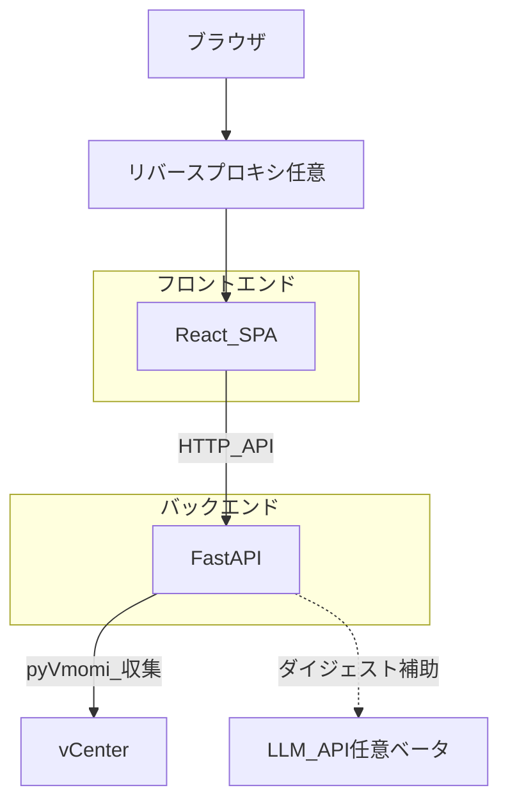
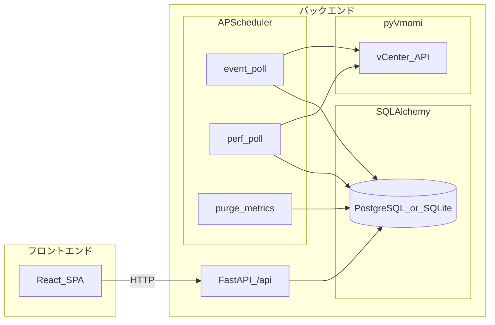

# アーキテクチャ

本書は vCenter Event Assistant の**構成とデータの流れ**を、図で把握するための入口である。モジュールごとのパス対応や改善タスクの一覧は [現状実装ベースのプラン](plans/2026-03-21-vcenter-event-assistant-as-built.md) を参照する。

## バックエンド

- **役割**: HTTP API（`/api`）、永続化、vCenter からの収集、定期ジョブ、環境設定に応じた LLM 呼び出し（ダイジェスト補助・ベータ）などを担う。
- **実装の所在**: [`src/vcenter_event_assistant/`](../src/vcenter_event_assistant/)（エントリは [`main.py`](../src/vcenter_event_assistant/main.py) の `create_app()`）。
- **主要要素**: **FastAPI**、**SQLAlchemy**（`DATABASE_URL` で **PostgreSQL** または **SQLite**）、**pyVmomi** による vCenter 接続、**APScheduler** による定期ポーリングとメトリクス削除、オプションの Bearer/Basic 認証。本番ではビルド済みの [`frontend/dist`](../frontend/dist) を同一プロセスから配信できる。

## フロントエンド

- **役割**: ダッシュボード・イベント一覧・vCenter 設定・メトリクス表示などの UI を **SPA** として提供し、バックエンドの **`/api`** を呼び出す。
- **実装の所在**: [`frontend/`](../frontend/)（**Vite 5** + **React** + **TypeScript**）。
- **開発時**: [`frontend/vite.config.ts`](../frontend/vite.config.ts) が `/api` および `/health` をバックエンドへプロキシする。ブラウザは Vite の開発サーバに接続し、API だけが別ポートの FastAPI へ転送される。

## システムコンテキスト

利用者はブラウザから **フロントエンド**にアクセスする。本番では **TLS・認証・ネットワーク制限はリバースプロキシ側**で行う想定である（アプリ単体では認証しない）。**バックエンド**が **pyVmomi** 経由で vCenter からイベントやホスト指標を収集する。環境設定により **LLM API** を用いたダイジェスト補助（ベータ）に接続し得る。

本番では多くの場合、フロントの静的ファイルと API が **同一オリジン**（`create_app()` による `frontend/dist` 配信）で提供される。下図は論理的な役割の分離を示す。

## データフロー（内部）

### フロントエンドからバックエンド API へ

**React SPA** は **`FastAPI /api`** に HTTP でリクエストし、画面に一覧・グラフなどを表示する。

### バックエンド内の収集と永続化

**APScheduler** がイベント／性能サンプルを vCenter から取得し **DB** に保存する。手動収集も同様にバックエンド経由で DB へ書き込む。**`/api`** は同一 DB を参照する。以下は [現状実装ベースのプラン §2](plans/2026-03-21-vcenter-event-assistant-as-built.md) のデータフローと同じ意味である。

## 関連ドキュメント

- [現状実装ベースのプラン](plans/2026-03-21-vcenter-event-assistant-as-built.md) — リポジトリ構成・モジュール対応・環境変数・API 一覧（§2 に簡略なデータフロー図あり。詳細な図は本書を参照）
- [フロントエンド画面の説明](frontend.md)
