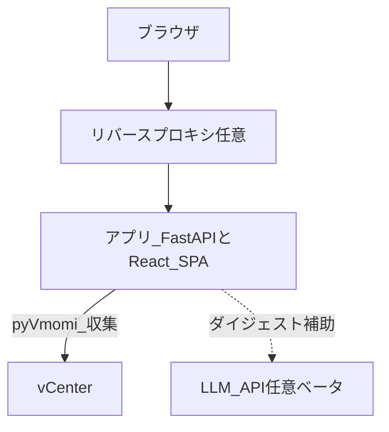
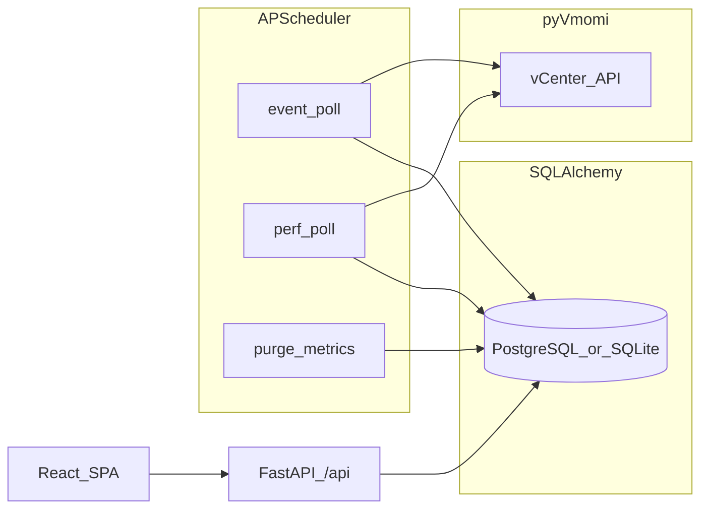

# アーキテクチャ

本書は vCenter Event Assistant の**構成とデータの流れ**を、図で把握するための入口である。モジュールごとのパス対応や改善タスクの一覧は [現状実装ベースのプラン](plans/2026-03-21-vcenter-event-assistant-as-built.md) を参照する。

## システムコンテキスト

利用者はブラウザからアプリにアクセスする。本番では **TLS・認証・ネットワーク制限はリバースプロキシ側**で行う想定である（アプリ単体では認証しない）。アプリは **pyVmomi** 経由で vCenter からイベントやホスト指標を収集する。環境設定により **LLM API** を用いたダイジェスト補助（ベータ）に接続し得る。

## データフロー（内部）

定期ジョブ（APScheduler）がイベント／性能サンプルを vCenter から取得し DB に保存する。API は同一 DB を参照し、React SPA が API を呼び出す。以下は [現状実装ベースのプラン §2](plans/2026-03-21-vcenter-event-assistant-as-built.md) のデータフローと同じ意味である。

## 関連ドキュメント

- [現状実装ベースのプラン](plans/2026-03-21-vcenter-event-assistant-as-built.md) — リポジトリ構成・モジュール対応・環境変数・API 一覧
- [フロントエンド画面の説明](frontend.md)
