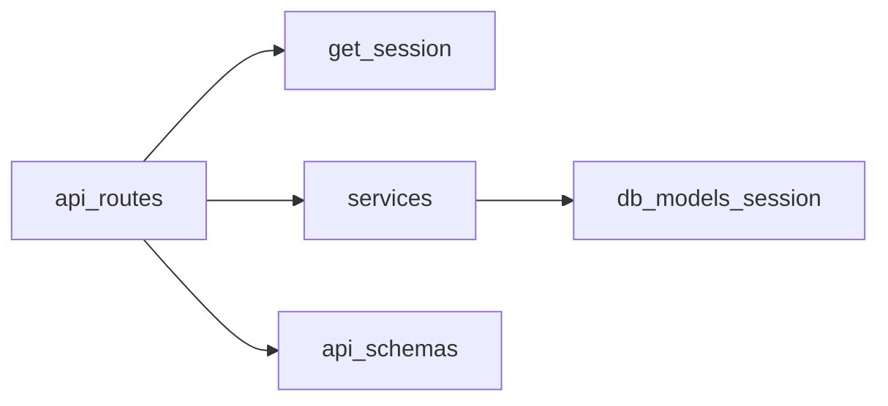

# バックエンド内部実装ガイド（API層中心）

本書は [`docs/backend.md`](backend.md) の補完として、**開発者がAPI改修に入るための内部地図**を提供する。第1版は **API層**（`api/routes` / `api/deps` / `api/schemas`）を中心に、責務・依存方向・典型フロー・変更時の注意点を整理する。

## 1. アプリ起動とHTTPレイヤの骨格（最小）

実装の起点は [`src/vcenter_event_assistant/main.py`](../src/vcenter_event_assistant/main.py) の `create_app()` である。

- **lifespan**: DB初期化（`init_db()`）→（設定により）スケジューラ起動
- **CORS**: `CORS_ORIGINS`（カンマ区切り）
- **APIキャッシュ抑止**: `/api` 配下のレスポンスに `Cache-Control: no-store` を付与するミドルウェア
- **ルーティング**:
  - `GET /health` は `health_router` として直下登録
  - 業務APIは `APIRouter(prefix="/api")` に束ね、各ドメインルーターを `include_router` する
- **静的配信**: `frontend/dist` が存在する場合のみ（本番相当の単一オリジン配信）

## 2. API層（中心）

### 2.1 ルーティングの見方（ファイルとURLの対応）

ルート実体は `src/vcenter_event_assistant/api/routes/` に置かれ、`main.py` で `prefix="/api"` の配下に取り込まれる。

現状のルーターモジュール（ファイル名）:

- `config.py` → `/api/config`
- `event_score_rules.py` → `/api/event-score-rules`
- `event_type_guides.py` → `/api/event-type-guides`
- `vcenters.py` → `/api/vcenters`
- `events.py` → `/api/events`
- `metrics.py` → `/api/metrics`
- `dashboard.py` → `/api/dashboard`
- `digests.py` → `/api/digests`
- `chat.py` → `/api/chat`
- `alerts.py` → `/api/alerts`
- `ingest.py` → `/api/ingest`
- `health.py` → `/health`（`/api` 外）

各ルーターは通常 `APIRouter(prefix="/<domain>")` を持ち、メソッド関数がエンドポイントとなる。

### 2.2 典型リクエストフロー（同期I/Oを含む場合あり）

多くのAPIは次の流れになる。

1. FastAPI がルート関数を呼ぶ
2. `Depends(get_session)` で DB セッションが注入される
3. ルートは `services/*` の関数を呼び、DB操作や外部処理を行う
4. レスポンスは `api/schemas` の Pydantic モデルで返す

vCenter 取得など **ブロッキング処理**は `services/ingestion.py` のように `asyncio.to_thread(...)` でスレッドへ逃がす実装が典型である。

### 2.3 DBセッション境界（最重要）

[`src/vcenter_event_assistant/api/deps.py`](../src/vcenter_event_assistant/api/deps.py) の `get_session()` は次の契約を持つ。

- ルート処理が正常終了したら **`commit()` する**
- 例外時は **`rollback()` して再送出**する

運用上の含意:

- ルート内で明示 `commit()` を多用しない方が安全（二重commitや意図しない分割トランザクションを避ける）
- 「検証より前に `commit()` が必要」など例外がある（例: `digests.py` の手動生成）。その場合は **理由がコードコメントで説明**されているため、変更時は必ず読む

### 2.4 `api/schemas`（公開契約）

`src/vcenter_event_assistant/api/schemas/` は **APIの入出力契約（Pydantic）**の置き場である。

- `__init__.py` は再exportを担い、既存import互換を維持する（例: `from .legacy import *`、`from .chat import *`）
- `base.py` は共通の基底設定（エイリアス等）を置く場所として使う
- 大きな変更は `legacy.py` と分割モジュールのバランスに影響するため、**フィールド追加は後方互換**を意識する

### 2.5 代表的な責務分割（読み始めの最短経路）

次は「ルートが薄く、サービスに集約される」読み方がしやすい。

- **イベント一覧/集計**: `api/routes/events.py` → `services/event_repository.py` / `services/event_type_guide_attach.py`
- **チャット**: `api/routes/chat.py` → `services/digest_context.py` / `services/chat_llm.py`（LLM実行）
- **ダイジェスト実行**: `api/routes/digests.py` → `services/digest_run.py`（生成と `DigestRecord` 永続化）

## 3. 変更時チェックリスト（API層）

- **URL/クエリ互換性**: 既存クライアントが依存しているクエリ名（例: `from` / `to` の alias）を壊さない
- **レスポンス互換性**: `api/schemas` のフィールド追加/削除はフロントとテストへ波及する
- **トランザクション境界**: `get_session()` の前提と矛盾する `commit()` を増やしていないか
- **テスト**: `tests/test_*_api.py` を起点に、最低限の回帰を追加する

## 4. 依存関係（概略）

## 5. 次フェーズ（本書の拡張候補）

- `collectors/*` と `services/ingestion.py` の収集パイプライン詳細
- `jobs/scheduler.py` とジョブID/ログの対応表
- LLMまわり（`services/llm_*`）の設定とトレース
