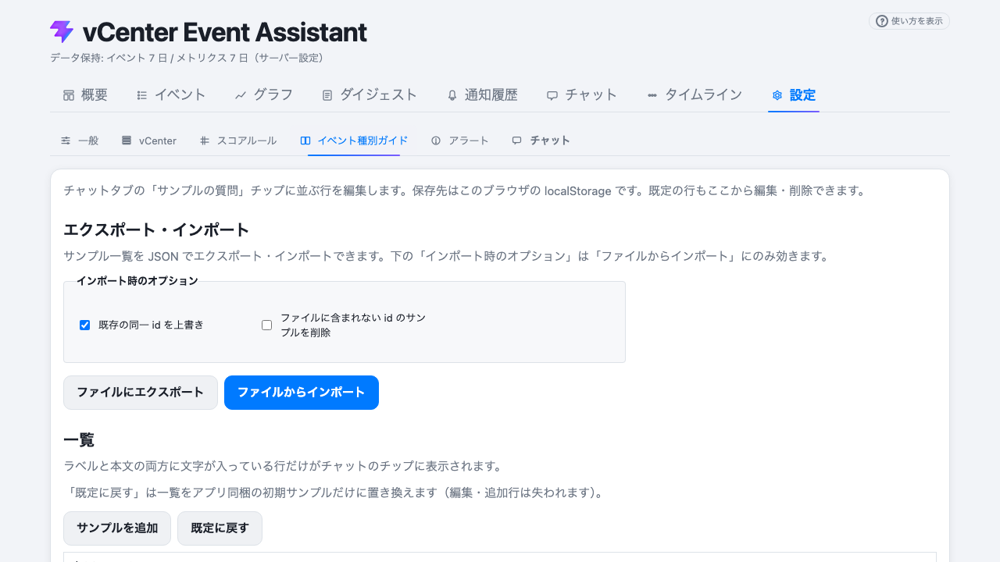

# チャット機能

vCenter Event Assistant のチャット機能は、収集した vCenter のイベントやホストメトリクスをコンテキスト（背景情報）として LLM（大規模言語モデル）に提供し、自然言語で対話しながら状況の分析や調査を行える機能です。

## 1. チャット機能の概要

本機能は、管理者が日々直面する「このエラーは何を意味しているのか？」「この時間帯に何が起きたのか？」といった疑問に対し、AI の力を借りて素早く答えを見つけることを目的としています。

- **vCenter データの注入**: 指定した期間のイベントやメトリクスを自動的にプロンプトに含めます。
- **対話ベースの分析**: 過去のやり取りを保持したまま（最大200件）、継続的な深掘りが可能です。
- **柔軟なコンテキスト**: 送信する情報の種類（イベントのみ、メトリクスのみ等）を調整できます。

## 2. 具体的な活用例（ユースケース）

### 例1：異常検知後の原因調査
特定の ESXi ホストでアラートが発生した際、チャットパネルでその時間帯を指定し、「最近発生したイベントと CPU 負荷の関連性を分析してください」と質問することで、負荷増大の引き金となったイベントを特定しやすくなります。

### 例2：週次レポートの深掘り
ダイジェスト機能で生成されたレポートを読み、「先週 1 週間のイベント集計から、最も再発防止策を講じるべき上位 3 つの事象を教えてください」と質問することで、膨大なデータから優先順位を整理できます。

## 3. 基本的な使い方

### ステップ 1: 期間の選択
チャットパネル上部のカレンダー、または「24時間」「7日間」などのプリセットボタンから、分析対象とする期間を選択します。

### ステップ 2: コンテキスト（情報）の選択
チャット入力欄の上部にあるチェックボックスで、送信する情報を制御します。
- **イベント**: 期間内のイベント種別ごとの件数、注目度の高いイベントの詳細を含めます。
- **メトリクス**: 各ホストの CPU/メモリ利用率の時系列データを含めます。

### ステップ 3: 質問の入力と送信
テキストボックスに質問を入力して送信します。

## 4. プロンプトスニペットの活用

よく使う質問を「スニペット」として登録しておくことで、入力を省力化し、チーム内で分析手法を標準化できます。

- **設定方法**: 「設定」タブ ＞ 「チャット」サブタブから、最大 5 つまでのスニペットを編集・保存できます。
- **呼び出し方**: チャットパネルの下部に表示されるスニペットボタンをクリックすると、入力欄にテキストが即座に反映されます。

## 5. 注意事項

- **トークン制限**: 送信するデータ（イベント/メトリクス）が膨大で LLM の入力上限（既定 32k トークン）を超える場合、自動的に古いデータから切り詰められます。
- **セキュリティと匿名化**: 環境変数 `LLM_ANONYMIZATION_ENABLED=true`（既定）の場合、ホスト名や IP アドレス、vCenter 名などはハッシュ化された状態で LLM に送信されます。LLM からの回答は、サーバー側で元の実名に逆変換されて表示されます。
