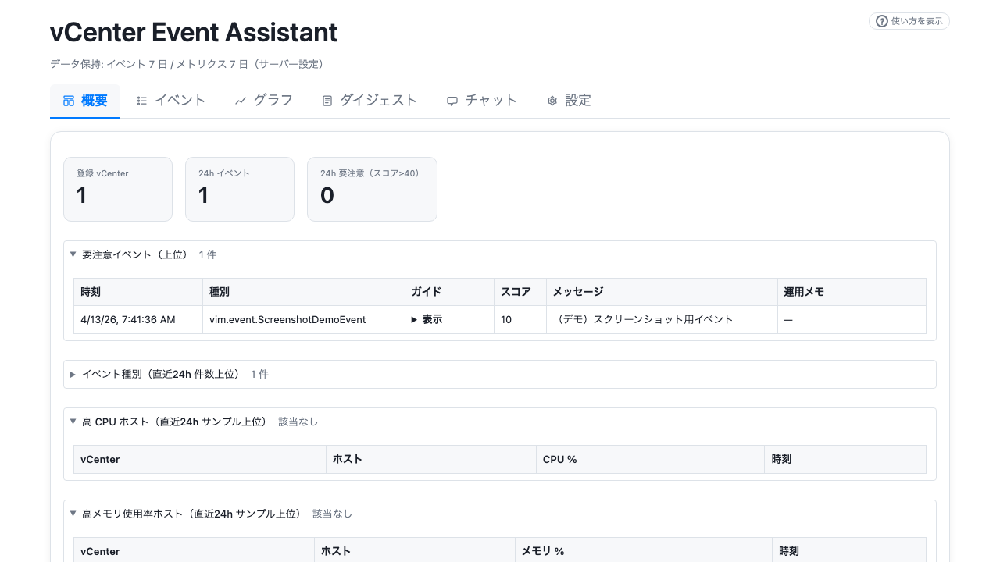
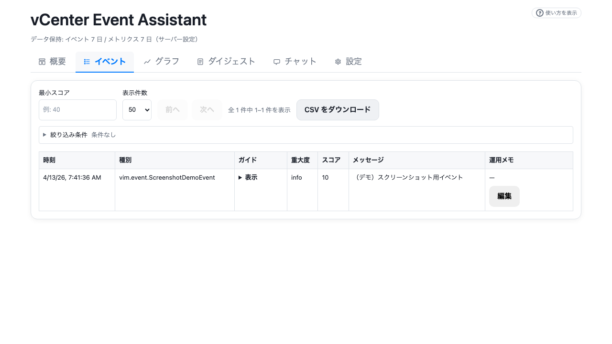
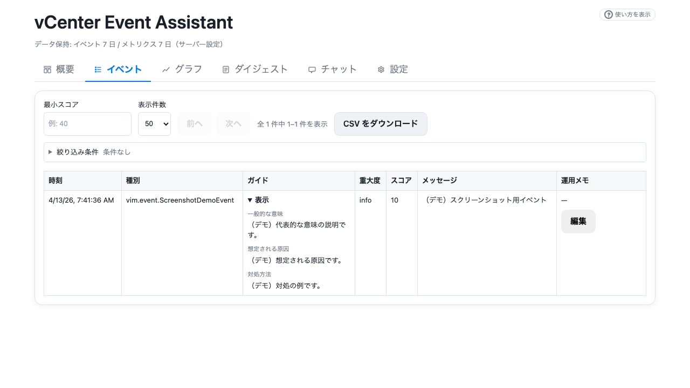
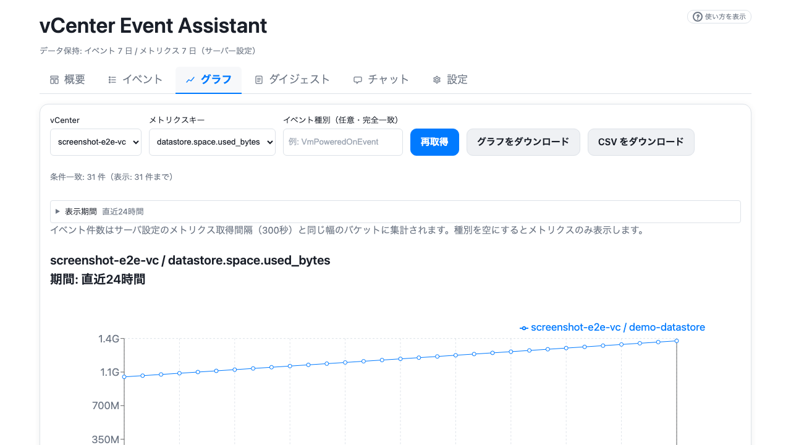
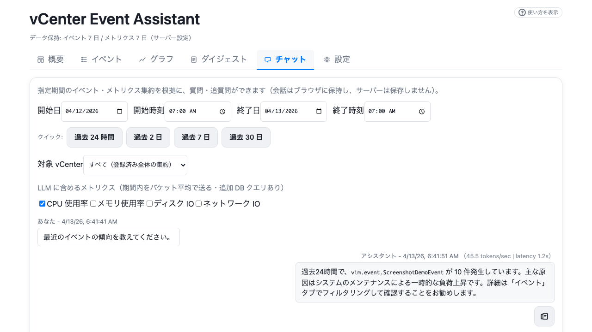
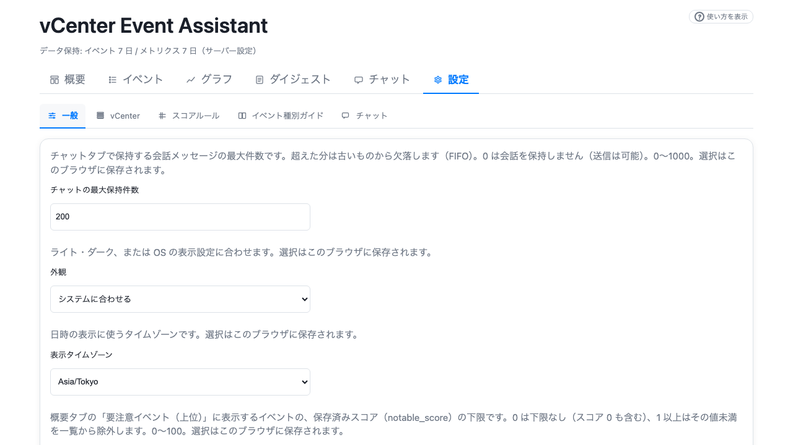
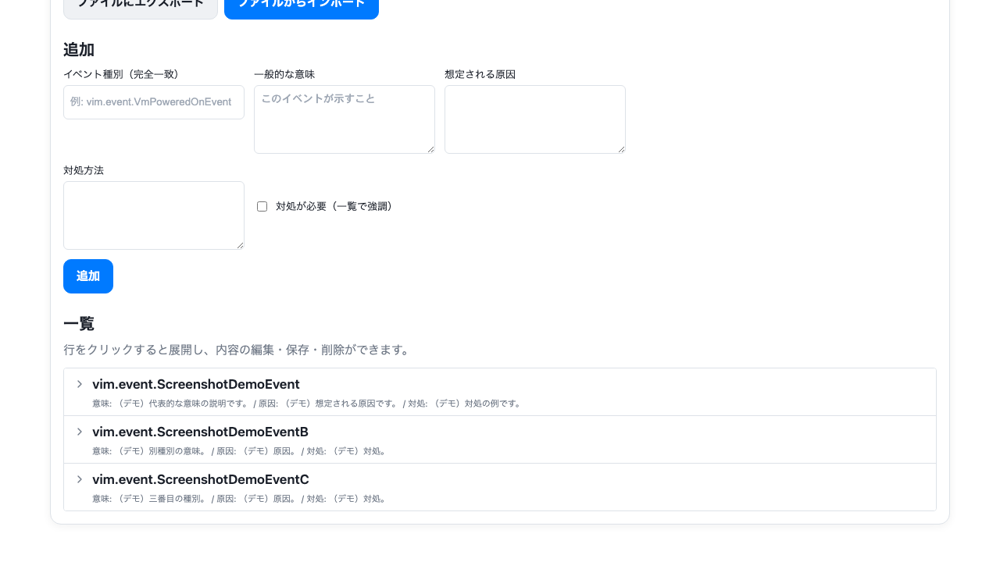
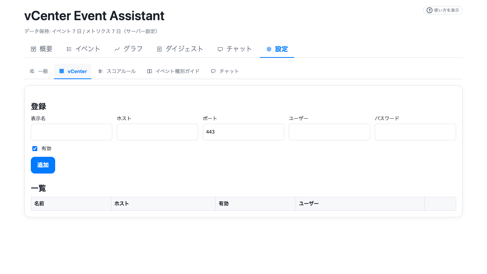
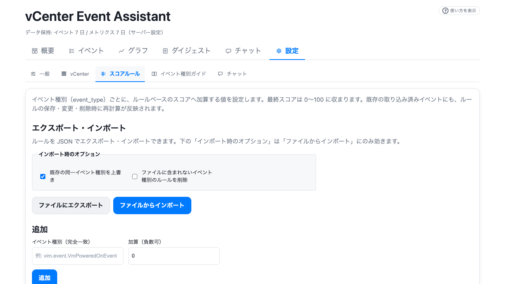

# vCenter Event Assistant（フロントエンド）

[vCenter Event Assistant](../README.md) の Web UI です。React・TypeScript・[Vite](https://vite.dev/) で実装し、バックエンドの FastAPI と同一オリジンまたは開発時プロキシ経由で API を呼び出します。イベントの一覧・概要、ホストメトリクスのグラフ、保存済みダイジェスト（Markdown）の参照、vCenter 登録やスコアルールなどの設定をブラウザから行えます。

## 画面の例

### 概要

登録 vCenter 数や直近のイベント件数、スコアの高い要注意イベントの俯瞰を表示します。



### イベント

収集した vCenter イベントを期間・キーワードなどで絞り込み、一覧表示や CSV 出力ができます。



種別ごとの説明（イベント種別ガイド）は、ガイド列の「表示」を開いて参照できます。下図は展開した例です。



### グラフ（メトリクス）

ホストの CPU・メモリなどの時系列を、vCenter とメトリクス種別を選んで表示します。



### ダイジェスト

サーバーが生成した日次などのダイジェストを一覧し、本文（表・LLM 要約を含む Markdown）を表示します。LLM 要約が記録されていない場合は `## LLM 要約` ブロックは表示しません。

### チャット

収集済みのイベントやホストメトリクスをコンテキストとして、LLM に質問できます。



### 設定（一般）

テーマ（ライト / ダーク / システム）や、日時表示に使うタイムゾーンをブラウザに保存します。



### 設定（イベント種別ガイド）

イベント種別ごとの意味・想定原因・対処を登録・編集し、JSON のエクスポート／インポートも行えます。。



### 設定（vCenter）

vCenter の接続情報を登録・編集・管理します。



### 設定（スコアルール）

イベント種別ごとのスコア加算値を設定します。



### その他の画面・キャプチャの更新

全タブの一覧と PNG の再取得手順は **[開発者向けメモ（`docs/development.md`）](development.md)** を参照してください。リポジトリルートで次を実行すると `docs/images/*.png` を更新できます。

```bash
# 既定: 起動済みの http://127.0.0.1:8000 に接続（フロントを更新したら build してサーバー再起動）
uv run scripts/capture_ui_screenshots.py
uv run scripts/capture_ui_screenshots.py --build
# メモリ DB ＋シード付きで Playwright が API を起動するとき（CI 等）
uv run scripts/capture_ui_screenshots.py --spawn-server
```

## 開発コマンド

`frontend` ディレクトリで実行します。


| コマンド                  | 説明                                       |
| --------------------- | ---------------------------------------- |
| `npm install`         | 依存関係のインストール                              |
| `npm run dev`         | 開発サーバー（HMR）                              |
| `npm run build`       | 本番用ビルド（`dist/`）                          |
| `npm run test`        | Vitest 単体テスト                             |
| `npm run lint`        | ESLint                                   |
| `npm run e2e`         | ビルド後に Playwright E2E（**テスト専用** API を Playwright が新規起動。既定ポート `9323`。`screenshots.spec.ts` は除外） |
| `npm run screenshots` | ドキュメント用スクリーンショットのみ取得（既定で `localhost:8000` の起動済み API 向け） |
| `npm run screenshots:spawn` | `npm run build` のうえ Playwright が API を起動して取得（シード付きメモリ DB） |

**E2E とドキュメント用キャプチャ:** `npm run e2e` は **手元の 8000 ではなく**、既定どおりテスト用インスタンス（別ポート）で検証する。ドキュメント用 PNG は **あらかじめ 8000 で API＋フロントを起動したうえで** `npm run screenshots` またはリポジトリルートの `uv run scripts/capture_ui_screenshots.py` を使う前提である。設定の詳細は [開発者向けメモ（`docs/development.md`）](development.md) を参照する。

バックエンドの起動・環境変数は [リポジトリルートの README](../README.md) を参照してください。

## ライセンス

本ディレクトリを含む本プロジェクトは [Apache License 2.0](../LICENSE) に従います。著作権表示は [NOTICE](../NOTICE) を参照してください。

## スタック補足

このディレクトリは `npm create vite@latest` 由来の構成を引き継いでいます。React Compiler の有効化、型対応 ESLint ルールの拡張、Vite の詳細は [Vite 公式ドキュメント](https://vite.dev/guide/) および [React ドキュメント](https://react.dev/) を参照してください。
