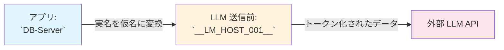
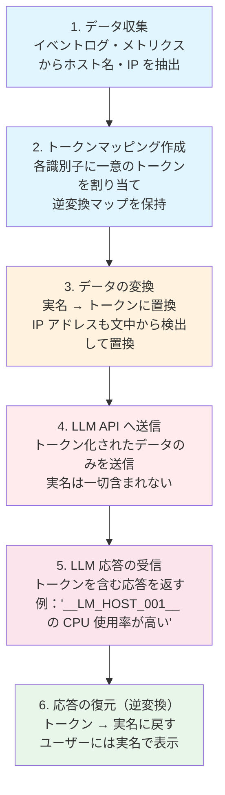

# LLM 入力におけるホスト名・IP アドレスの匿名化仕組み

このページでは、VCenter Event Assistant が外部 LLM（ChatGPT など）にデータを送信する際に、**ホスト名や IP アドレスなどの機密情報をどのように保護しているか**を非プログラマ向けに説明します。

## 1. 概要：なぜ匿名化が必要なのか？

LLM サービスを利用すると、アプリケーションから送ったデータは外部サーバーへ転送されます。この際、以下のような情報が含まれる可能性があります：

| 情報種別 | 例 | 機密性 |
|---------|-----|--------|
| **ホスト名** | `esxi-host-01.prod.local` | 社内インフラの構造が露呈する |
| **IP アドレス** | `192.168.1.100` | ネットワーク構成が推測可能 |
| **VM/サーバー名** | `DB-Server-01`, `Web-Frontend-Tokyo` | 重要な資産の名称が外部に漏れる |
| **ユーザー名** | `admin`, `jsmith@company.com` | 権限を持つアカウント情報が露呈する |

これらの情報をそのまま LLM に送信すると、**インフラ構成やシステム名が外部サービスへ知られてしまうリスク**があります。このドキュメントでは、それを防ぐ仕組みを解説します。

## 2. 基本コンセプト：「見せかけの名前」への置換

匿名化のアイデアはシンプルです：**「実名を一時的な仮の名前に置き換え、LLM に送る」**



- **実名**: `DB-Server` → **仮名**: `__LM_HOST_001__`
- LLM は仮名を通じて「あるサーバーの状況」を理解できる
- 外部サービスには実名が一切伝わらない

## 3. トークン化の詳細

### 3.1 トークンの形式

匿名化後の名前は、以下のような形式になります：

```
__LM_カテゴリ_連番__
```

例：
| カテゴリ | 原文 | トークン（仮名） |
|---------|------|-----------------|
| `HOST` | `esxi-host-01.prod.local` | `__LM_HOST_001__` |
| `IP` | `192.168.1.100` | `__LM_IP_003__` |
| `USER` | `admin@company.com` | `__LM_USER_002__` |

### 3.2 一貫性の保証

同じ実名には常に**同じトークン**が割り当てられます：

```
esxi-host-01.prod.local → __LM_HOST_001__（初回）
esxi-host-01.prod.local → __LM_HOST_001__（2 回目も同じ！）
```

これにより、LLM は「`__LM_HOST_001__` が常に同じサーバーを指す」ことを学習できます。

### 3.3 FQDN と短縮名の統合

ホスト名が完全修飾ドメイン名（FQDN）の場合、その短縮形も同一のトークンに紐づけます：

```
esxi-host-01.prod.local → __LM_HOST_001__
esxi-host-01          → __LM_HOST_001__  ← 同じトークンを共有
```

LLM は「両方とも同じサーバーを指す」と理解できます。

## 4. 保護される情報の種類

### 4.1 ホスト名・サーバー名

vCenter に登録された ESXi ホスト：

- `esxi-host-01.prod.local`

### 4.2 IP アドレス

文中に含まれる IPv4 アドレスも自動的に検出・匿名化されます：

```
"サーバー 192.168.1.100 が応答していません"
→ "サーバー __LM_IP_001__ が応答していません"
```

### 4.3 ユーザー名

ログインユーザーや管理者アカウント：

- `admin`
- `jsmith@company.com`
- `root`

### 4.4 vCenter 表示名

管理対象の vCenter サーバーの表示名：

- `Production-vCenter`
- `Disaster-Recovery-VC`

## 5. 処理の流れ



**図の解説**:

- **青色（データ収集・マッピング）**: サーバー内での処理
- **オレンジ色（変換）**: 匿名化処理
- **赤色（LLM 送信）**: 外部 API への通信
- **緑色（復元）**: ユーザー表示前の処理

## 6. サーバー側での逆変換

LLM から返された応答は、**サーバー側で自動的に実名に戻されます**。ユーザーがアプリで見ているのは常に実名のままです。

| LLM が返す | ユーザーに表示される |
|-----------|-------------------|
| `__LM_HOST_001__ の CPU 使用率が 95% です` | `esxi-host-01.prod.local の CPU 使用率が 95% です` |
| `IP __LM_IP_003__ から不正アクセスの可能性` | `IP 203.0.113.50 から不正アクセスの可能性` |

**ユーザーは匿名化の存在を意識する必要はありません。**

## 7. 設定によるオンオフ

管理者は環境変数で機能を有効/無効にできます：

| 環境変数 | デフォルト | 説明 |
|---------|-----------|------|
| `LLM_ANONYMIZATION_ENABLED` | `true` | 匿名化を有効にする |

開発・検証時には一時的に無効化することも可能です。

## 8. 具体的な例

### 8.1 チャット質問の例

ユーザーが以下のように質問します：

> 「esxi-host-01.prod.local の CPU使用率 を教えてください」

LLM に送られるデータ：

```
「__LM_HOST_001__ の CPU使用率 を教えてください」
```

LLM の応答：

```
"__LM_HOST_001__ の CPU 使用率は 85% です"
```

ユーザーに表示される結果：

> 「esxi-host-01.prod.local の CPU 使用率は 85% です」

### 8.2 ダイジェストの例

ダイジェスト要約前に：

```markdown
## esxi-host-01.prod.local の監視情報

- IP: 192.168.1.100
- ユーザー：admin@company.com
- CPU 使用率：85%
```

LLM に送られるデータ（すべて `__LM_XXX_NNN__` 形式）：

```markdown
## __LM_HOST_001__ の監視情報

- IP: __LM_IP_002__
- ユーザー：__LM_USER_003__
- CPU 使用率：85%
```

## 9. よくある質問

### Q1: トークン化されたデータを LLM が正しく処理できるか？

**はい、問題ありません。** LLM は「`__LM_HOST_001__` といった名前のサーバー」として扱います。同じ名前には常に同じトークンが割り当てられるため、一貫した理解が可能です。

### Q2: 逆変換でデータは漏れないか？

**大丈夫です。** 逆変換マップはサーバー内でのみ使用され、LLM 送信時には使用されず、外部に渡されることはありません。

### Q3: 匿名化を無効にできるか？

開発・検証時には `LLM_ANONYMIZATION_ENABLED=false` で無効化できますが、**運用時は有効のままにする**ことを推奨します。
また、LLMをオンプレミスで運用される場合などは、無効化しても問題ありません。

### Q4: トークン形式は固定か？

トークンの連番はランダムですが、**同じ実名には常に同一のトークン**が割り当てられます。一貫性は保証されます。

## 10. まとめ

VCenter Event Assistant は、外部 LLM サービスを利用する際にも、以下の仕組みで機密情報を保護しています：

1. **ホスト名・IP アドレス・ユーザー名などを匿名化**してから LLM に送信
2. **サーバー側で自動復元**するため、ユーザーは常に実名を閲覧可能
3. **設定でオンオフ制御**可能（デフォルトは有効）

これらの仕組みにより、**利便性を保ちながらセキュリティリスクを最小限に抑える**ことが可能です。

## 11. 参照

- コード：[`src/vcenter_event_assistant/services/llm_anonymization.py`](../src/vcenter_event_assistant/services/llm_anonymization.py)

