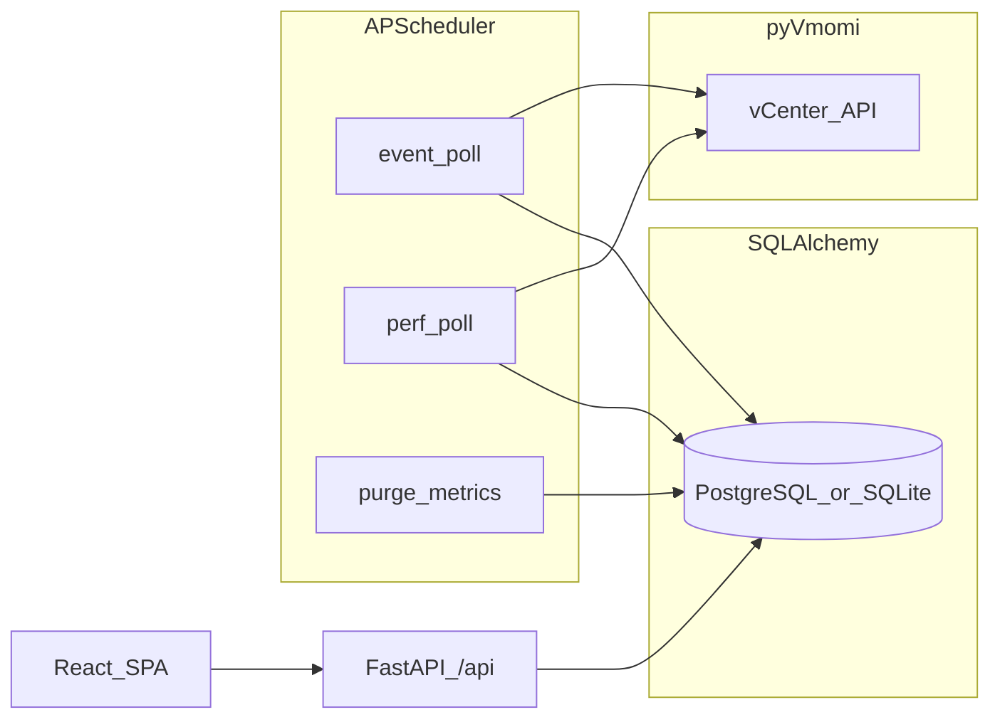

# vCenter Event Assistant — 現状実装ベースのプラン

> **For Claude:** REQUIRED SUB-SKILL: Use superpowers:executing-plans to implement this plan task-by-task.

**Goal:** 本リポジトリに既に存在する「vCenter イベント・ホスト指標の収集と Web ダッシュボード」の実装を、新規参加者が追えるように文書化し、今後の小さな改善タスクに分解する。

**Architecture:** バックエンドは FastAPI（`create_app()` ファクトリ）。起動時に SQLAlchemy で `create_all`、オプションで APScheduler がイベント／性能サンプルを定期実行。収集は **pyVmomi**（`pyVmomi` / `pyVim`）を `asyncio.to_thread` で実行。永続化は **PostgreSQL（asyncpg）** または **SQLite（aiosqlite）** の `DATABASE_URL` 切替。フロントは Vite 5 + React + TypeScript、`/api` を開発時プロキシ。

**Tech Stack:** Python 3.12+、`uv`、FastAPI、Pydantic v2 / pydantic-settings、SQLAlchemy 2 非同期、asyncpg、aiosqlite、APScheduler、pyVmomi、pytest / ruff。フロント: React 19、Recharts、Vite 5。

---

## 1. リポジトリ構成（現状）

| パス | 役割 |
|------|------|
| [`src/vcenter_event_assistant/main.py`](../../src/vcenter_event_assistant/main.py) | `create_app()`、lifespan、`/api` ルータ、手動収集 `POST /api/ingest/run`、[`frontend/dist`](../../frontend/dist) がある場合の静的配信と SPA フォールバック |
| [`src/vcenter_event_assistant/settings.py`](../../src/vcenter_event_assistant/settings.py) | `DATABASE_URL`、認証、CORS、スケジューラ間隔、メトリクス保持日数 |
| [`src/vcenter_event_assistant/db/models.py`](../../src/vcenter_event_assistant/db/models.py) | `VCenter`, `EventRecord`, `MetricSample`, `IngestionState` |
| [`src/vcenter_event_assistant/db/session.py`](../../src/vcenter_event_assistant/db/session.py) | 非同期エンジン（SQLite 時 `StaticPool` + `PRAGMA foreign_keys=ON`） |
| [`src/vcenter_event_assistant/api/deps.py`](../../src/vcenter_event_assistant/api/deps.py) | `get_session`（成功時 `commit`） |
| [`src/vcenter_event_assistant/api/routes/vcenters.py`](../../src/vcenter_event_assistant/api/routes/vcenters.py) | vCenter CRUD、`GET /{id}/test` 接続テスト |
| [`src/vcenter_event_assistant/api/routes/events.py`](../../src/vcenter_event_assistant/api/routes/events.py) | イベント一覧・フィルタ |
| [`src/vcenter_event_assistant/api/routes/metrics.py`](../../src/vcenter_event_assistant/api/routes/metrics.py) | メトリクス時系列 |
| [`src/vcenter_event_assistant/api/routes/dashboard.py`](../../src/vcenter_event_assistant/api/routes/dashboard.py) | ダッシュボード集約 |
| [`src/vcenter_event_assistant/api/routes/health.py`](../../src/vcenter_event_assistant/api/routes/health.py) | `GET /health` |
| [`src/vcenter_event_assistant/auth/dependencies.py`](../../src/vcenter_event_assistant/auth/dependencies.py) | Bearer / Basic（未設定なら認証なし） |
| [`src/vcenter_event_assistant/collectors/connection.py`](../../src/vcenter_event_assistant/collectors/connection.py) | `SmartConnect` / `read_connection_info` |
| [`src/vcenter_event_assistant/collectors/events.py`](../../src/vcenter_event_assistant/collectors/events.py) | EventManager 経由のイベント取得・正規化 |
| [`src/vcenter_event_assistant/collectors/perf.py`](../../src/vcenter_event_assistant/collectors/perf.py) | ホスト `quickStats` 由来の CPU/メモリ使用率 |
| [`src/vcenter_event_assistant/services/ingestion.py`](../../src/vcenter_event_assistant/services/ingestion.py) | DB へのイベント／メトリクス投入、古いメトリクス削除 |
| [`src/vcenter_event_assistant/rules/notable.py`](../../src/vcenter_event_assistant/rules/notable.py) | イベントのスコア・タグ |
| [`src/vcenter_event_assistant/jobs/scheduler.py`](../../src/vcenter_event_assistant/jobs/scheduler.py) | 定期ポーリング・パージ |
| [`frontend/src/App.tsx`](../../frontend/src/App.tsx) | 概要・イベント・vCenter・メトリクス UI（手動収集ボタン等） |
| [`frontend/vite.config.ts`](../../frontend/vite.config.ts) | `/api`・`/health` のプロキシ |
| [`tests/`](../../tests/) | `conftest.py`（SQLite メモリ、`SCHEDULER_ENABLED=false`）、ヘルス・ルール・vCenter API |
| [`.github/workflows/ci.yml`](../../.github/workflows/ci.yml) | `uv sync --all-groups`、`ruff`、`pytest` |
| [`.env.example`](../../.env.example) | `DATABASE_URL` 例 |

---

## 2. データフロー（現状）



---

## 3. 環境変数（主要）

| 変数 | 意味 |
|------|------|
| `DATABASE_URL` | `postgresql+asyncpg://...` または `sqlite+aiosqlite:///...` |
| `AUTH_BEARER_TOKEN` / `AUTH_BASIC_*` | 設定時のみ認証必須 |
| `SCHEDULER_ENABLED` | `false` で定期ジョブ無効（テスト等） |
| `CORS_ORIGINS` | カンマ区切り |
| `EVENT_POLL_INTERVAL_SECONDS` / `PERF_SAMPLE_INTERVAL_SECONDS` / `METRIC_RETENTION_DAYS` | 収集・削除ポリシー |

---

## 4. API 一覧（プレフィックス `/api` 除くルート名）

| メソッド | パス | 説明 |
|---------|------|------|
| GET | `/health` | ヘルス（認証なし） |
| GET/POST/PATCH/DELETE | `/vcenters` … | CRUD |
| GET | `/vcenters/{id}/test` | 接続テスト |
| GET | `/events` | クエリ: `from`/`to`/`min_score`/ページング |
| GET | `/metrics` | `metric_key` 必須、`vcenter_id` 任意 |
| GET | `/dashboard/summary` | 集約サマリー |
| POST | `/ingest/run` | 全有効 vCenter の手動収集 |

---

## 5. 実行コマンド（検証用）

```bash
uv sync --all-groups
uv run ruff check src tests
uv run pytest -q
uv run vcenter-event-assistant
# フロント別ターミナル: cd frontend && npm run dev
```

---

## 6. 今後の改善タスク（バイトサイズ）

以下は **未実装／強化候補**。各タスクは独立して取り込み可能。

### Task A: メトリクス API のメタデータ

**Files:**
- Modify: [`src/vcenter_event_assistant/api/routes/metrics.py`](../../src/vcenter_event_assistant/api/routes/metrics.py)
- Modify: [`src/vcenter_event_assistant/api/schemas.py`](../../src/vcenter_event_assistant/api/schemas.py)
- Modify: [`frontend/src/App.tsx`](../../frontend/src/App.tsx)（レスポンス型）

**Step 1:** `GET /api/metrics` のレスポンスに `total` 件数をヘッダ `X-Total-Count` または JSON ラッパで付与するテストを `tests/test_metrics_api.py` に追加。

**Step 2:** 実装して `uv run pytest tests/test_metrics_api.py -v` が通るまで修正。

**Step 3:** コミット。

---

### Task B: Alembic マイグレーション導入

**Files:**
- Create: `alembic.ini`、`alembic/env.py`（非同期エンジン）
- Modify: [`pyproject.toml`](../../pyproject.toml)（ドキュメントのみ）

**Step 1:** `uv run alembic init alembic` 後、既存モデルから初回リビジョンを生成。

**Step 2:** `init_db` を「開発時のみ create_all、本番は migrate」に切替える場合は別 PR で明記。

---

### Task C: PerformanceManager ベースの指標（任意・大きめ）

**Files:**
- Modify: [`src/vcenter_event_assistant/collectors/perf.py`](../../src/vcenter_event_assistant/collectors/perf.py)

**Step 1:** `quickStats` に加え、対象ホストで `PerfManager.QueryStats` を試す統合テストは vCenter モックまたは記録フィクスチャで追加。

**Step 2:** 段階的にカウンタを追加（YAGNI）。

---

### Task D: 設計ドキュメントの同期

**Files:**
- Modify: [`README.md`](../../README.md)（現状は空に近い場合あり）

**Step 1:** 上記「実行コマンド」「DATABASE_URL」節を README に要約コピー。

**Step 2:** コミット。

---

## Execution Handoff

プランは [`docs/plans/2026-03-21-vcenter-event-assistant-as-built.md`](2026-03-21-vcenter-event-assistant-as-built.md) に保存済み。

**実行の選び方:**

1. **同一セッションでサブエージェント駆動** — タスクごとにサブエージェントを回し、タスク間でレビュー（superpowers:subagent-driven-development）
2. **別セッション** — 新規チャットで superpowers:executing-plans を使い、チェックポイント付きで一括実行

どちらで進めますか？
