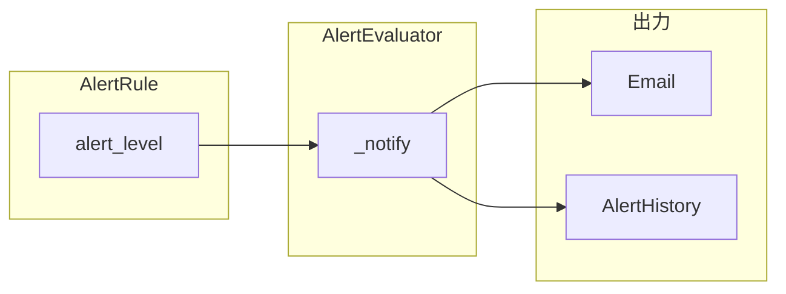

# アラートにレベル（critical / error / warning）を追加する

## 現状の整理

- ルール本体は [`AlertRule`](src/vcenter_event_assistant/db/models.py)（`name`, `rule_type`, `is_enabled`, `config` JSON）。
- 評価・通知は [`AlertEvaluator`](src/vcenter_event_assistant/services/alert_eval.py) が `_notify` で [`NotificationRenderer`](src/vcenter_event_assistant/services/notification/renderer.py) に `context`（`rule_name`, `state`, `context_key`, `fired_at`, ...）を渡し、同梱 Jinja（[`alert_firing.txt.j2`](src/vcenter_event_assistant/templates/alert_firing.txt.j2) 等）で件名・本文を生成。
- API スキーマは [`AlertRuleCreate` / `Read` / `Update`](src/vcenter_event_assistant/api/schemas/legacy.py)。フロントは [`AlertRulesPanel.tsx`](frontend/src/panels/settings/AlertRulesPanel.tsx)（新規作成・有効トグル・削除のみ）、履歴は [`AlertHistoryPanel.tsx`](frontend/src/panels/alerts/AlertHistoryPanel.tsx)。
- イベント行の `severity`（VMware 由来）は別概念であり、本件の「運用上のレベル」と混同しない。

## レベルの意味（ユーザー定義の反映）

| レベル | 意味（運用メッセージ） |
|--------|------------------------|
| critical（クリティカル） | サービス影響の可能性が高く、**すぐ**対処が必要 |
| error（エラー） | サービス影響の可能性が高く、**対処が必要**（原文の「対象」は誤記とみなし **対処** で扱う） |
| warning（警告） | 直接的なサービス影響は想定しにくく、**検討**が必要 |

API/DB では安定キー `critical` / `error` / `warning`、UI では日本語ラベルを表示するのがよい。

## アプローチ比較（2〜3案）

1. **`alert_rules` に専用カラム `alert_level`（推奨）**
   - 利点: スキーマが明確、一覧・将来のフィルタが容易、`config` と責務が分離。
   - 欠点: Alembic でカラム追加が必要。

2. **`config` 内のみ（例: `config.alert_level`）**
   - 利点: マイグレーションが軽い。
   - 欠点: バリデーションが散らびやすい、一覧の意味が `config` 依存。

3. **ルールには持たず通知時だけ計算（閾値やメトリクスから自動）**
   - 利点: UI で選ばなくてよい。
   - 欠点: ユーザーが示した「クリティカル＝即対応」等の運用判断を機械的に当てにくい。将来拡張は可能だが、まずは手動設定が素直。

**推奨: 案1（専用カラム）＋通知履歴へのスナップショット**
ルールのレベルは運用者がルール単位で指定。通知送信時点のレベルを履歴に残すと、ルール変更後も「当時どの重大度で飛んだか」が追える。

## 推奨データモデル

- `alert_rules.alert_level`: `String(32)` 程度、値は上記3つのみ（アプリ層で `Literal` + DB では CHECK 省略可、pytest で担保でも可）。
- `alert_history.alert_level`: 同型。`_notify` で `AlertHistory` 作成時に `rule.alert_level` をコピー（NULL 許容はマイグレーション互換のため一度だけ検討。新規は非 NULL 推奨）。
- 既存行: マイグレーションで `alert_rules.alert_level` にデフォルト `warning`（既存デプロイへの心理的負荷が最小）。運用で重要ルールは UI/API で引き上げる。

## API・バリデーション

- [`AlertRuleCreate` / `Update` / `Read`](src/vcenter_event_assistant/api/schemas/legacy.py): フィールド `alert_level: Literal["critical", "error", "warning"]`（Create は必須、Read は必ず返す、Update は Optional）。
- [`create_alert_rule`](src/vcenter_event_assistant/api/routes/alerts.py): `AlertRule(..., alert_level=body.alert_level)`。
- `PATCH` で `alert_level` 更新可能にする。

## 評価・通知

- [`_notify` の `context`](src/vcenter_event_assistant/services/alert_eval.py) に `alert_level` と、テンプレート用の日本語ラベル（例: `alert_level_label`）を追加。
- [`alert_firing.txt.j2` / `alert_resolved.txt.j2`](src/vcenter_event_assistant/templates/): 件名または本文先頭にレベルを含める（カスタムテンプレ利用者向けに、変数はドキュメントかコメントで列挙）。

## フロントエンド

- [`AlertRulesPanel.tsx`](frontend/src/panels/settings/AlertRulesPanel.tsx): 新規フォームにレベル `<select>`。一覧テーブルに「レベル」列とバッジ（既存の `state-badge` と同様の CSS パターンで色分け）。
- 既存ルールのレベル変更: `PATCH` で `alert_level` のみ送る UI（行ごとドロップダウン or 編集モーダル）を最小で追加するか、最初は「新規のみ変更・既存は設定画面から再保存で変更」に割り切るかは実装時に選択。推奨は行内セレクト + debounce なしの即 PATCH（件数が少ない想定）。
- [`AlertHistoryPanel.tsx`](frontend/src/panels/alerts/AlertHistoryPanel.tsx): `AlertHistoryRead` に `alert_level` を足したうえで列「レベル」を追加。

## テスト

- 既存の [`tests/test_alert_eval_metrics.py`](tests/test_alert_eval_metrics.py) 等: ルールに `alert_level` を設定した場合、`AlertHistory` に期待値が入ること、レンダラ context に含まれることを確認（必要なら renderer の単体テスト）。
- API: ルール作成・PATCH で不正値が 422 になること。

## ドキュメント（任意・小さく）

- [`docs/backend.md`](docs/backend.md) またはアラート節があるドキュメントに、レベルの意味とフィールド名を1段落追記（プロジェクト方針どおり日本語で可）。

## リスク・注意

- メール件名が長くなりすぎないよう、`[FIRING][critical]` のような短いプレフィックスに留める。
- カスタム Jinja パス利用者はテンプレを自前更新する必要がある旨をリリースノート程度で触れる。

