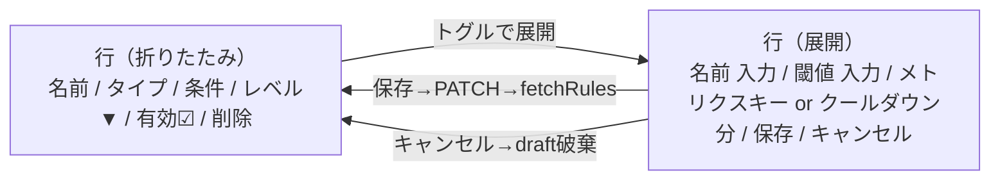

# 既存アラートルールの編集機能（設定画面のインライン編集）

## 目的

[`AlertRulesPanel.tsx`](../../frontend/src/panels/settings/AlertRulesPanel.tsx) では現在、既存ルールに対しては「有効/無効」と「レベル」しか変更できない。`name`・`config.threshold`・`config.metric_key`・`config.cooldown_minutes` を **行を展開してインライン編集** できるようにし、ルール変更のために「削除→新規作成」する運用を不要にする。

## 現状

- バックエンド: [`PATCH /api/alerts/rules/{rule_id}`](../../src/vcenter_event_assistant/api/routes/alerts.py) は既に `name` / `is_enabled` / `alert_level` / `config` を任意更新可能（[`AlertRuleUpdate`](../../src/vcenter_event_assistant/api/schemas/legacy.py)）。`config` は **全置換**。
- ただし `patch_alert_rule` は **同名重複の 409 チェックを行っていない**（`create_alert_rule` のみ実装）。
- フロント: [`AlertRulesPanel.tsx`](../../frontend/src/panels/settings/AlertRulesPanel.tsx) は新規作成フォーム＋一覧テーブルのみで、行内編集 UI は無い。
- 既存パターン: [`EventTypeGuidesPanel.tsx`](../../frontend/src/panels/settings/EventTypeGuidesPanel.tsx) が `<details>/<summary>` で行を展開してインライン編集する UX を採用済み。本件もこれに揃える。

## スコープ

| 項目 | 編集可否 | 補足 |
|---|---|---|
| `name` | 可 | 一意制約あり。PATCH 側に重複チェックを追加 |
| `is_enabled` | 可（現状維持） | 行サマリのチェックボックスで即時 PATCH |
| `alert_level` | 可（現状維持） | 行サマリのセレクトで即時 PATCH |
| `config.threshold` | 可（新規） | 必須・数値 |
| `config.metric_key` | 可（新規） | `rule_type === 'metric_threshold'` のときだけ表示 |
| `config.cooldown_minutes` | 可（新規） | `rule_type === 'event_score'` のときだけ表示。未指定時の既定 10 分（[`alert_eval.py L35`](../../src/vcenter_event_assistant/services/alert_eval.py)） |
| `rule_type` | **不可** | 切替は `config` 構造を変えるため、削除→新規作成で代替する旨を UI に注記 |

## UX



- 行はテーブル構造のままにし、名前セル内のトグルボタン（シェブロン）で展開。
- 「レベル」「有効」「削除」は **サマリ側に残す**（即時操作・展開不要）。
- 行全体クリックは使わず、トグル操作に限定して誤タップを防ぐ。
- `draft: Record<number, EditDraft>` を保持し、未保存変更があるときだけ「保存」を活性化。`rule.id` ごとに独立。
- 保存成功で `fetchRules()` し、`draft[id]` を破棄。
- 展開領域に「タイプは変更できません。条件タイプを変える場合は削除して再作成してください。」のヒント文を 1 行表示。

## データモデル / API 変更

DB / モデル / スキーマは変更不要。バックエンドは [`patch_alert_rule`](../../src/vcenter_event_assistant/api/routes/alerts.py) に **名前重複チェック** だけを追加する。

```python
# 既存の if body.name is not None: rule.name = body.name の前に挟む
if body.name is not None and body.name != rule.name:
    res = await session.execute(
        select(AlertRule).where(
            AlertRule.name == body.name,
            AlertRule.id != rule_id,
        )
    )
    if res.scalar_one_or_none():
        raise HTTPException(
            status_code=409,
            detail="Alert rule with this name already exists",
        )
```

`config` の更新仕様は据え置き（フロント側で **既存 `config` をマージしてから** 送る方針で欠落を防ぐ）。

## フロントエンド変更

対象は [`AlertRulesPanel.tsx`](../../frontend/src/panels/settings/AlertRulesPanel.tsx)、CSS は [`AlertRulesPanel.css`](../../frontend/src/panels/settings/AlertRulesPanel.css)。

主な追加要素:

- 型: `interface EditDraft { name: string; threshold: number; metric_key?: string; cooldown_minutes?: number }`。
- ステート: `const [draft, setDraft] = useState<Record<number, EditDraft>>({})`。
- 関数:
  - `getDraft(rule)`: `draft[id]` がなければ `rule` から初期化して返す（保存処理用）。
  - `updateDraft(id, patch)`: 部分更新。
  - `handleSaveEdit(rule)`: 必須バリデーション後、
    `apiPatch('/api/alerts/rules/' + rule.id, { name, config: { ...rule.config, threshold, metric_key?, cooldown_minutes? } })` を送信。成功で `draft[id]` を削除し `fetchRules()`。
  - `handleCancelEdit(id)`: `draft[id]` を削除。
- 一覧の `<tr>` を `<tr>` のままで残し、その内側でなく **行直下に `<details>` 風の展開行**（既存 EventTypeGuides は `<ul>` ベースだが、AlertRules は table 構造のため `colSpan` を使った 2 行構成にする）。
  - 1 行目: 既存サマリ（変更なし）。
  - 2 行目: `<tr className="edit-row" hidden={!isExpanded}><td colSpan={6}>…編集フォーム…</td></tr>`。
  - 展開状態は `expandedId: number | null` を管理（同時に 1 行のみ展開、UX 簡素化）。
- 編集フォームのレイアウトは新規作成フォームと同じ `form-grid` クラスを再利用。
- アクセシビリティ: 各入力に `aria-label` を付与（例: `${rule.name} の閾値`）。

## テスト

[`tests/test_alerts_api.py`](../../tests/test_alerts_api.py) に以下を追加:

- `test_patch_alert_rule_renames_name`: 既存ルールの `name` を変更でき、レスポンスに反映される。
- `test_patch_alert_rule_duplicate_name_returns_409`: 別ルールと同名に変更すると 409 を返す。
- `test_patch_alert_rule_updates_config_and_keeps_alert_level`: `config` を更新しても `alert_level` 等の他フィールドが保持される（クライアントがマージして送る前提のため、テストでは PATCH の `config` 全置換挙動を明示する）。

フロントは現状 `AlertRulesPanel` に単体テストが無いため、本対応では追加しない（既存方針と整合）。

## ドキュメント

- [`docs/backend.md`](../backend.md) のアラート節に「`PATCH /api/alerts/rules/:id` の `name` は重複時 409、`config` は全置換」を 1 行追記。
- `docs/features_list.md` の「アラートルール」行は ✅ のままで変更不要。

## リスク・判断

- **`config` 全置換のまま据え置く**: API 仕様の互換性を優先。フロント側のマージで欠落を防ぐ。将来 PATCH に部分マージを入れるならスキーマも変えることになるため、本件のスコープ外。
- **同時編集の競合**: 楽観ロックは導入しない。最後の保存が勝つ。運用想定で同時編集はまれ。
- **`rule_type` 非対応**: 変更可能にすると `config` 構造の自動変換が要るため UI とロジックが複雑化。本件では明示的に対象外とし、UI ヒントで誘導。
- **`<details>` ではなく `colSpan` の 2 行構成にする理由**: テーブル意味論を壊さず、`expandedId` の制御で「1 行だけ展開」を強制できる。EventTypeGuides は `<ul>` 構造なので `<details>` をそのまま使えるが、こちらはテーブルなので方式を変える。

## 実装順序（小さく分割）

1. **バックエンド**: [`patch_alert_rule`](../../src/vcenter_event_assistant/api/routes/alerts.py) に名前重複チェックを追加し、対応するテストを 3 件追加。
2. **フロント**: `AlertRulesPanel.tsx` に `expandedId` / `draft` ステート、展開行、保存/キャンセルハンドラを追加。CSS 微調整。
3. **ドキュメント**: `docs/backend.md` に 1 行追記。

各ステップで `uv run pytest` および `npm run build`（フロント）が通ることを確認する。
