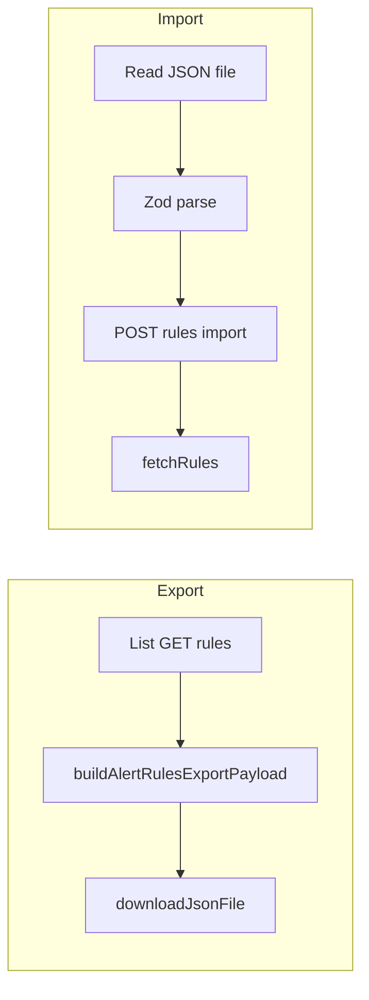

# アラートルール JSON エクスポート／インポート実装計画

**作成:** 2026-05-06（Cursor プランをリポジトリ用に保存）

## 概要

スコアルール／イベント種別ガイドと同じ JSON エクスポート・インポート UX（format 識別子、上書き／ファイル外削除オプション、確認ダイアログ）を、アラートルールの自然キー「ルール名」に対応させて追加する。バックエンドは `POST /api/alerts/rules/import` と Pydantic、フロントは Zod と既存パネル CSS。**実装は TDD（pytest / Vitest）。** 実装開始時は **using-git-worktrees** で隔離ワークスペース（本リポは `.worktrees/` が `.gitignore` 済み）を推奨。

## 実装タスク（チェックリスト）

- [ ] **git-worktree-baseline:** using-git-worktrees: `.worktrees/<branch>` に feature ブランチ、`git check-ignore` 確認、`uv sync` / `npm ci` 等、baseline pytest+Vitest が緑
- [ ] **tdd-backend-red:** pytest 先行: `POST /api/alerts/rules/import` の振る舞いテストを追加し、未実装であることを確認して RED
- [ ] **tdd-backend-green:** GREEN: Pydantic（ImportRequest/Response）+ `alerts.py` の import ルートでテスト通過、REFACTOR で重複整理
- [ ] **tdd-frontend-red:** Vitest 先行: `alertRulesFileSchema` / `buildAlertRulesExportPayload` 等の期待テストを書き RED を確認
- [ ] **tdd-frontend-green:** GREEN: `schemas.ts`・`alertRulesImportErrors.ts` 実装 → REFACTOR
- [ ] **frontend-panel-ui:** `AlertRulesPanel`: エクスポート・インポート UI（既存パターン・エラー整形）。必要ならコンポーネント結合の最小テスト

## Git worktree（実装セッション開始時・推奨）

**using-git-worktrees**（Cursor superpowers）に従い、本機能の実装に入る前に **隔離ワークスペース**を用意する。

### 本リポジトリの前提

- **配置先の優先順**: 既存ディレクトリがあればそれを使う（`.worktrees` を `worktrees` より優先）。本リポの `.gitignore` に **`.worktrees/`** が記載済み（並行チェックアウト用）。ルートに `CLAUDE.md` が無いため **プロジェクト直下の `.worktrees/<ブランチ名>`** を既定とする。
- **作成前の安全確認**: プロジェクトローカルに worktree を置く場合は **`git check-ignore -q .worktrees`** が成功することを確認する（未 ignore なら `.gitignore` に追記してから作成）。

### 手順（要約）

1. `git worktree add .worktrees/<branch> -b <branch>`（例: `feature/alert-rules-json-io`）。
2. そのパスで依存同期（このリポは Python は **`uv sync`**、フロントは **`npm ci` / `npm install`** を `package.json` に合わせる）。
3. **ベースライン検証**: `uv run pytest` とフロントの `npm test`（またはプロジェクト標準スクリプト）を実行し、**着手前から失敗がない**ことを確認。失敗している場合は計画どおりユーザーに報告し、続行可否を取る。

実装エージェントは作業開始時に「using-git-worktrees で隔離する」と短く宣言し、完了後は **finishing-a-development-branch** skill と整合してマージ／PR／worktree 削除を検討する。

## TDD（テスト駆動開発）— 本機能の実装順

**test-driven-development**（Cursor superpowers）に従い、**本番コードより先に失敗するテスト**を書く。**コードが先でテストが後のときは TDD にならない**（テストが即パスしても意味がない）。

### 鉄則

- **プロダクションコードは、先に失敗したテストなしには書かない**（要件どおりの失敗理由で RED を確認してから GREEN）。
- **RED の確認は省略しない**: `uv run pytest …` / `npm test …` で失敗を見たうえで実装する。
- **GREEN は最小限**: import の振る舞いを満たすだけの Pydantic・ルート・Zod を足す。
- **REFACTOR は GREEN の後だけ**: 命名・重複排除（振る舞い追加は別サイクル）。

### 推奨サイクル（本計画）

1. **バックエンド**: [`tests/test_alerts_api.py`](../../tests/test_alerts_api.py)（または専用ファイル）に **import API の 1 本目**（例: 正常系で `rules_count` が返る／または 400 の重複）を書く → `pytest` で **404 や未実装で落ちる**ことを確認 → `AlertRulesImportRequest` / ルート実装で GREEN → 残りケース（上書き・削除・空ファイル）を **テスト 1 件ずつ RED→GREEN** で足す。
2. **フロント（スキーマ）**: `buildAlertRulesExportPayload` とファイル Zod の **Vitest** を先に書く（不正 `format`・`name` 重複で期待メッセージ）→ RED 確認 → [`schemas.ts`](../../frontend/src/api/schemas.ts) 等で GREEN。
3. **UI**: スキーマと API が緑のあと、[`AlertRulesPanel.tsx`](../../frontend/src/panels/settings/AlertRulesPanel.tsx) にエクスポート／インポートを載せる。UI は既存パネルと同パターンで手戻りを減らす。**React の細かい DOM テストは必須としない**（Zod と API 契約で主な振る舞いを担保）。

### アンチパターン（禁止）

- import ルートを実装してから「後から pytest を足す」だけにする。
- Zod を書いてから「ついでにテスト」を足し、初回から GREEN になるだけにする。

## 現状整理

| 項目 | スコアルール／ガイド | アラートルール（今回） |
|------|----------------------|------------------------|
| 自然キー | `event_type`（完全一致） | [`AlertRule.name`](../../src/vcenter_event_assistant/db/models.py)（ユニーク） |
| 既存の import API | あり | **未実装**（[`alerts.py`](../../src/vcenter_event_assistant/api/routes/alerts.py) は CRUD のみ） |
| フロント | [`ScoreRulesPanel.tsx`](../../frontend/src/panels/settings/ScoreRulesPanel.tsx) 等 | [`AlertRulesPanel.tsx`](../../frontend/src/panels/settings/AlertRulesPanel.tsx) に export/import セクションなし |

参照実装: バックエンドは [`import_event_type_guides`](../../src/vcenter_event_assistant/api/routes/event_type_guides.py)（再計算なし・件数のみ返す）、フロントは [`buildEventTypeGuidesExportPayload`](../../frontend/src/api/schemas.ts) + `eventTypeGuidesFileSchema` + `downloadJsonFile`。

## 推奨アプローチ（案1: 完全パターン合わせ）

**案1（推奨）**: ガイド／スコアルールと同じファイル形状パターンを踏襲する。

- `format: "vea-alert-rules"`、`version: 1`、`exportedAt?`、`rules: AlertRuleCreate[]`（DB の `id` / `created_at` は含めない）。
- `POST /api/alerts/rules/import` に `overwrite_existing`、`delete_rules_not_in_import`、`rules` を渡す。
- ファイル内 `name` の重複は **400**（`detail` は既存ガイドの `duplicate event_type in guides` に倣い `duplicate name in rules` など **英語固定**でテスト可能に）。
- 各行: `name` で `select` → なければ create、あれば `overwrite_existing` が true のとき **name / rule_type / is_enabled / alert_level / config をすべて上書き**（ガイドの全フィールド上書きと同じ）。既存の [`patch_alert_rule`](../../src/vcenter_event_assistant/api/routes/alerts.py) は `rule_type` を触らないが、**インポート専用ルート内で ORM を直接更新**すれば PATCH を広げずに済む。
- `delete_rules_not_in_import`: ファイル内 `name` の集合 `S`。`S` が空かつフラグ true のときは **全ルール削除**（スコアルールと同パターン）。それ以外は `name ∉ S` を `delete`。FK は既存マイグレーションどおり **CASCADE** 想定で履歴・状態も消える — UI で危険オプションに同意確認（空ファイル時はスコアルールと同様の `confirm` 文案をアラート用に差し替え）。

**案2**: `POST /api/alerts/import` に top-level import を置く。実装は案1と同じだが URL が `/rules` 以外に逃げる。既存の `/api/alerts/rules` 構成と並びがやや不揃い。

**案3**: エクスポートのみ先に出す。運用上はインポートがないと移行価値が半減するため非推奨。

## API・スキーマ設計

- **Pydantic**（[`legacy.py`](../../src/vcenter_event_assistant/api/schemas/legacy.py) またはアラート用にまとまっている箇所へ）:
  - `AlertRulesImportRequest`: `overwrite_existing: bool = True`、`delete_rules_not_in_import: bool = False`、`rules: list[AlertRuleCreate]`（既存 [`AlertRuleCreate`](../../src/vcenter_event_assistant/api/schemas/legacy.py) を再利用）。
  - `AlertRulesImportResponse`: `rules_count: int` のみ（イベント再計算は不要）。
- **ルート**: [`alerts.py`](../../src/vcenter_event_assistant/api/routes/alerts.py) に `POST /rules/import` を追加。`/rules/{rule_id}` より **先に登録**するとパス解決が明快（`rule_id: int` は `"import"` とマッチしないが、可読性のため）。
- **OpenAPI / フロント**: フルパスは **`/api/alerts/rules/import`**（[`main.py`](../../src/vcenter_event_assistant/main.py) の `/api` プレフィックス前提）。

## フロントエンド

- [`frontend/src/api/schemas.ts`](../../frontend/src/api/schemas.ts): `alertRuleExportEntrySchema`（`AlertRuleCreate` 相当: `name`, `rule_type`, `is_enabled`, `alert_level`, `config`）、`alertRulesFileSchema`（`format` literal、`version`、`rules` 配列、**rules 内 `name` 重複**は `superRefine`）、`buildAlertRulesExportPayload`、`alertRulesImportResponseSchema`。
- [`AlertRulesPanel.tsx`](../../frontend/src/panels/settings/AlertRulesPanel.tsx): パネル冒頭（説明文の直後）に **「エクスポート・インポート」** ブロックを追加。`overwriteExisting` / `deleteRulesNotInImport` の state、非表示 `input[type=file]`、`downloadJsonFile`、`confirm`（削除オプション＋空ファイル）、既存の **`score-rules-import-options` / `score-rules-file-actions`** クラスを流用してガイド／スコアルールと同じ見た目にする。
- パースエラー用に [`scoreRulesImportErrors.ts`](../../frontend/src/panels/settings/scoreRulesImportErrors.ts) と同様の **`alertRulesImportErrors.ts`**（または既存を一般化）を追加し、`format`／重複 `name`／必須フィールド向けの日本語メッセージを定義。
- API エラーは既存の `toErrorMessage` 経由で統一可能ならそれに合わせ、422/400 の文言が分かるようにする。

## テスト（TDD と同一の振る舞い一覧）

上記 **TDD セクションの順**で追加する。**pytest**（[`tests/test_alerts_api.py`](../../tests/test_alerts_api.py) 等）:

- ファイル内 `name` 重複 → 400
- `overwrite_existing=True` で既存ルールの `rule_type` / `config` / `alert_level` が更新される（PATCH に無い `rule_type` 更新をインポートで確認できるとよい）
- `delete_rules_not_in_import` でファイルに無いルールが削除される／空集合 + フラグで全削除

**Vitest**: Zod の `format`・`name` 重複・`buildAlertRulesExportPayload`（version / exportedAt / rules 配列）を **スキーマ実装より先に**テストで固定する。

## データフロー（概要）

## ブラインストーミング skill との関係

Skill では設計承認後に `docs/superpowers/specs/` へ設計書コミットと **writing-plans** へ進む流れ。本タスクは既存パターンが明確なため、**本計画で実装に十分な具体度**とする。必要なら別途短い設計メモを `docs/superpowers/specs/` に置くかどうかはチーム運用に委ねる（ユーザー依頼がなければスキル必須の新規 doc は省略してよい）。

## リスク・注意

- **ルール削除**はアラート状態・履歴も CASCADE で失われる。オプション説明文で明示する。
- **設定の互換**: 将来 `config` の形が変わった場合は `version` を上げる方針をコメントまたは README に一言残すとよい（今回は version 1 で固定）。
