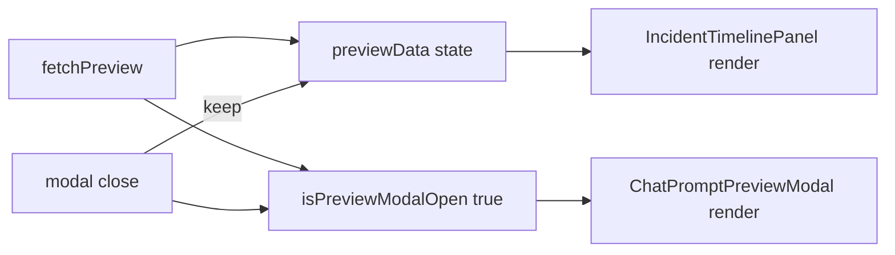

# Timeline Modal Visibility Fix Implementation Plan

> **For agentic workers:** REQUIRED SUB-SKILL: Use superpowers:subagent-driven-development (recommended) or superpowers:executing-plans to implement this plan task-by-task. Steps use checkbox (`- [ ]`) syntax for tracking.

**Goal:** プレビューモーダルを閉じてもインシデント統合タイムラインが消えないようにし、タイムラインをモーダル背面表示ではなく操作導線として安定表示する。

**Architecture:** `previewData`（データ）とモーダル開閉状態を分離する。`ChatPanel` でタイムライン表示条件をデータ存在に限定し、モーダルの close では `previewData` を破棄しない。既存の preview 取得・再取得フローは維持する。

**Tech Stack:** React + TypeScript + Vitest + Testing Library

---

## Worktree Policy

- 実装は必ず `git worktree` 上で行う（`main` 直作業を禁止）。
- 既存の作業先を利用する: `/Users/moriyama/git/vcenter-event-assistant/.worktrees/feature-incident-timeline-mvp`
- 着手前チェック:
  - `git -C "/Users/moriyama/git/vcenter-event-assistant/.worktrees/feature-incident-timeline-mvp" branch --show-current`
  - `git -C "/Users/moriyama/git/vcenter-event-assistant/.worktrees/feature-incident-timeline-mvp" status --short`
  - `pwd` がワークツリー配下であること
  - 期待値: ブランチが `feature/incident-timeline-mvp` であること

---

## File Structure / Responsibility

- Modify: [frontend/src/panels/chat/ChatPanel.tsx](frontend/src/panels/chat/ChatPanel.tsx)
  - `previewData` とモーダル開閉状態の責務分離
  - モーダル close 時の状態遷移を修正
- Modify: [frontend/src/panels/chat/ChatPanel.test.tsx](frontend/src/panels/chat/ChatPanel.test.tsx)
  - 「モーダル close 後もタイムライン保持」の回帰テスト追加
- (Optional) Check only: [frontend/src/panels/chat/ChatPromptPreviewModal.tsx](frontend/src/panels/chat/ChatPromptPreviewModal.tsx)
  - `onClose` の呼び出し契約が現実装と一致しているか確認

## Data Flow (after fix)



## Task 1: モーダル状態の分離（TDD）

**Files:**
- Modify: `frontend/src/panels/chat/ChatPanel.test.tsx`
- Modify: `frontend/src/panels/chat/ChatPanel.tsx`

- [ ] **Step 1: 失敗テストを先に追加（モーダルを閉じてもタイムラインが残る）**

```tsx
it('モーダルを閉じてもタイムラインは保持される', async () => {
  // preview取得 -> timeline表示 -> modal close -> timelineが残ることを検証
})
```

- [ ] **Step 2: RED確認**

Run: `npm run --prefix frontend test -- src/panels/chat/ChatPanel.test.tsx`
Expected: 追加テストが FAIL（close 時に previewData が null 化されるため）

- [ ] **Step 3: 最小実装で状態分離**

```tsx
const [previewData, setPreviewData] = useState<ChatPreviewResponse | null>(null)
const [isPreviewModalOpen, setIsPreviewModalOpen] = useState(false)

// preview取得時
setPreviewData(out)
setIsPreviewModalOpen(true)

// close時
setIsPreviewModalOpen(false) // setPreviewData(null) はしない
```

- [ ] **Step 4: GREEN確認**

Run: `npm run --prefix frontend test -- src/panels/chat/ChatPanel.test.tsx`
Expected: 追加テストを含め PASS

- [ ] **Step 5: 影響範囲テスト実行**

Run: `npm run --prefix frontend test -- src/panels/chat/IncidentTimelinePanel.test.tsx src/panels/chat/ChatPanel.test.tsx src/api/schemas.test.ts`
Expected: PASS

- [ ] **Step 6: コミット**

```bash
git add frontend/src/panels/chat/ChatPanel.tsx frontend/src/panels/chat/ChatPanel.test.tsx
git commit -m "fix(chat): keep incident timeline visible after closing preview modal"
```

## Task 2: 表示契約の回帰防止

**Files:**
- Modify: `frontend/src/panels/chat/ChatPanel.test.tsx`
- (Optional) Modify: `frontend/src/panels/chat/ChatPromptPreviewModal.tsx`

- [ ] **Step 1: モーダル再表示のテスト追加**

```tsx
it('保存済み previewData があればモーダル再表示できる', async () => {
  // close後にプレビューボタン再押下でモーダル表示復帰
})
```

- [ ] **Step 2: RED確認**

Run: `npm run --prefix frontend test -- src/panels/chat/ChatPanel.test.tsx`
Expected: FAIL（再表示経路が未実装の場合）

- [ ] **Step 3: 最小実装（必要時のみ）**

```tsx
// 既存previewDataを利用してモーダル開閉のみ制御
if (previewData) setIsPreviewModalOpen(true)
```

- [ ] **Step 4: GREEN確認**

Run: `npm run --prefix frontend test -- src/panels/chat/ChatPanel.test.tsx`
Expected: PASS

- [ ] **Step 5: コミット**

```bash
git add frontend/src/panels/chat/ChatPanel.test.tsx frontend/src/panels/chat/ChatPromptPreviewModal.tsx
git commit -m "test(chat): cover preview modal and timeline state transitions"
```

## Verification Checklist

- [ ] プレビュー取得後、モーダルが開く
- [ ] モーダルを閉じてもタイムラインが残る
- [ ] 再度プレビュー操作でモーダルが再表示される
- [ ] 既存チャット送信・プレビュー取得テストが破綻しない

## Save Location

- 実行用プラン保存先（ユーザー指定）: `docs/plans/2026-05-07-chat-preview-modal-timeline-visibility-fix-plan.md`
- 追記方針: 既存 `docs/plans/2026-05-07-incident-timeline-mvp-plan.md` には「フォローアップ不具合修正」としてリンクを追加
