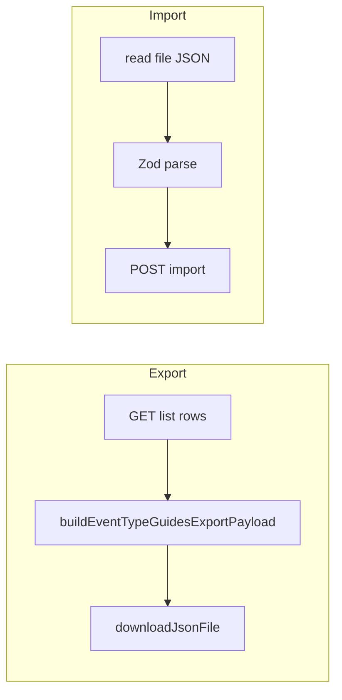

# イベント種別ガイド JSON エクスポート／インポート Implementation Plan

> **For agentic workers:** REQUIRED SUB-SKILL: Use `superpowers:subagent-driven-development`（推奨）または `superpowers:executing-plans` でタスク単位に実装。チェックボックス（`- [ ]`）で進捗管理。

**Goal:** イベント種別ガイドの設定を **JSON ファイルに書き出し**、同形式のファイルから **一括取り込み**できるようにする（既存のスコアルールの UX・API 形と揃える）。

**Architecture:** フロントは [`ScoreRulesPanel.tsx`](../../../frontend/src/panels/settings/ScoreRulesPanel.tsx) と同じ流れ（`format` 識別子付き JSON、`build*ExportPayload`、非表示 `input[type=file]`、`overwrite_existing` / `delete_*_not_in_import`）。バックエンドは [`event_score_rules.py`](../../../src/vcenter_event_assistant/api/routes/event_score_rules.py) の `import_event_score_rules` と同じトランザクション内ロジック（ファイル内 `event_type` 重複は 400、行ごとに create / patch / skip、フラグ時はファイルに無い行を delete）。ガイドは **イベントスコア再計算が不要**なので、レスポンスは `guides_count` のみ（`events_updated` は持たない）。

**Tech Stack:** FastAPI / Pydantic v2 / SQLAlchemy 2.0 async / Zod / Vitest / 既存 [`EventTypeGuide`](../../../src/vcenter_event_assistant/db/models.py)・[`EventTypeGuideCreate`](../../../src/vcenter_event_assistant/api/schemas.py)

**前提:** DB スキーマ変更は不要（既存列で完結）。

---

## 計画レビュー反映（2026-03-22）

`plan-document-reviewer` の指摘を反映済み。

- **Markdown:** Architecture のリンク表記を修正（`event_score_rules` 参照が壊れないようにした）。
- **セッション:** [`get_session`](../../../src/vcenter_event_assistant/api/deps.py) はリクエスト正常終了時に `commit` するため、インポートルート内では **`session.commit()` を呼ばず**、他 CRUD と同様に `flush` / `refresh` に留める旨を Task 1 に明記した。
- **スタイル表:** `.score-rules-*` 行の誤ったバッククォートを解消。
- **粒度:** エージェント実行で再現性を上げたい場合は、各 Task を「失敗テスト → 実装 → 緑」のサブステップに分割してよい（本書は中粒度のまま）。

---

## ファイル構成（新規・変更）

| 役割 | パス |
|------|------|
| インポート用スキーマ・レスポンス | 変更 [`src/vcenter_event_assistant/api/schemas.py`](../../../src/vcenter_event_assistant/api/schemas.py) — `EventTypeGuidesImportRequest` / `EventTypeGuidesImportResponse`（`guides: list[EventTypeGuideCreate]`、`overwrite_existing`、`delete_guides_not_in_import`） |
| インポート API | 変更 [`src/vcenter_event_assistant/api/routes/event_type_guides.py`](../../../src/vcenter_event_assistant/api/routes/event_type_guides.py) — `POST ""` の直後に `POST "/import"` を定義（パス順序: `/import` を `/{guide_id}` より上に置く） |
| バックエンドテスト | 変更 [`tests/test_event_type_guides_api.py`](../../../tests/test_event_type_guides_api.py) |
| Zod・エクスポートペイロード | 変更 [`frontend/src/api/schemas.ts`](../../../frontend/src/api/schemas.ts) — `eventTypeGuideExportEntrySchema`、`eventTypeGuidesFileSchema`（`format: z.literal('vea-event-type-guides')`）、`buildEventTypeGuidesExportPayload`、インポート応答スキーマ |
| 単体テスト | 新規 `frontend/src/api/eventTypeGuidesFile.test.ts`（[`scoreRulesFile.test.ts`](../../../frontend/src/api/scoreRulesFile.test.ts) を模倣） |
| エラー整形 | 新規 `frontend/src/panels/settings/eventTypeGuidesImportErrors.ts`（[`scoreRulesImportErrors.ts`](../../../frontend/src/panels/settings/scoreRulesImportErrors.ts) と同構造。文言は「ガイド」「guides」「各フィールド」向けに差し替え） |
| JSON ダウンロード共通化（推奨） | 新規 `frontend/src/utils/downloadJsonFile.ts` に `downloadJsonFile` を切り出し、[`ScoreRulesPanel.tsx`](../../../frontend/src/panels/settings/ScoreRulesPanel.tsx) から import に変更（重複排除） |
| UI | 変更 [`frontend/src/panels/settings/EventTypeGuidesPanel.tsx`](../../../frontend/src/panels/settings/EventTypeGuidesPanel.tsx) — 「エクスポート・インポート」セクション（スコアルールと同クラス名 `score-rules-import-options` / `score-rules-file-actions` を流用可） |
| スタイル | 追加 CSS は **不要**なら省略（既存の `score-rules-import-options` / `score-rules-file-actions` 等で足りる） |

---

## JSON ファイル仕様（確定事項）

- **format:** 固定文字列 `vea-event-type-guides`（スコアルールの `vea-event-score-rules` と対になる名前）
- **version:** 整数 `1`（将来フィールド追加時にインクリメント）
- **exportedAt:** ISO 文字列（任意。エクスポート時に付与）
- **guides:** 配列。要素は **DB の id を含まない**。各要素は API の `EventTypeGuideCreate` と同じキー: `event_type`, `general_meaning`, `typical_causes`, `remediation`, `action_required`
- **重複:** 同一ファイル内で `event_type` が重複したら Zod（フロント）と API（バックエンド）の両方で拒否

---

## データフロー（概要）

---

## Task 1: Pydantic と `POST /import`

**Files:** [`schemas.py`](../../../src/vcenter_event_assistant/api/schemas.py)、[`event_type_guides.py`](../../../src/vcenter_event_assistant/api/routes/event_type_guides.py)

- `EventTypeGuidesImportRequest`: `overwrite_existing: bool = True`、`delete_guides_not_in_import: bool = False`、`guides: list[EventTypeGuideCreate]`
- ハンドラ先頭で `event_type` の重複チェック（小文字化しない。**完全一致**。スコアルールと同じ）→ 重複時 `HTTP 400`、`detail="duplicate event_type in guides"`（テストで assert）
- 各行: `select` で既存 → なければ `EventTypeGuide(...)` を `add`、あれば `overwrite_existing` が True のとき全フィールド更新（create と同じ値セット）、False ならスキップ
- `delete_guides_not_in_import`: ファイル内 `event_type` の集合 `S`。`S` が空かつフラグ True なら **全ガイド削除**（スコアルールと同パターン）。それ以外は `~EventTypeGuide.event_type.in_(S)` で `delete`
- **セッション:** `get_session`（[`deps.py`](../../../src/vcenter_event_assistant/api/deps.py)）はリクエスト正常終了時に `commit` する。ルート内では **`session.commit()` を呼ばない**（他の CRUD と同様に `flush` / `refresh` に留める）。
- `EventTypeGuidesImportResponse`: `guides_count: int` のみ

**参照実装:** [`import_event_score_rules`](../../../src/vcenter_event_assistant/api/routes/event_score_rules.py) 59–93 行付近（`delete` は `from sqlalchemy import delete`）

---

## Task 2: バックエンドテスト

**Files:** [`tests/test_event_type_guides_api.py`](../../../tests/test_event_type_guides_api.py)

- 重複 `event_type` → 400
- `overwrite_existing=True` で既存行のテキスト・`action_required` が更新される
- `overwrite_existing=False` で既存は変わらない
- `delete_guides_not_in_import=True` でファイルに無い種別が削除される
- 空 `guides` + `delete_guides_not_in_import=True` で全削除（確認ダイアログはフロントのみ）

実行例: `uv run pytest tests/test_event_type_guides_api.py -v`

---

## Task 3: Zod・ビルダー・Vitest

**Files:** [`frontend/src/api/schemas.ts`](../../../frontend/src/api/schemas.ts)、新規 `frontend/src/api/eventTypeGuidesFile.test.ts`

- `eventTypeGuideExportEntrySchema`: `event_type` の trim + 長さ、`action_required`、`general_meaning` 等は null 許容（スコアルールの export entry と同様に厳しめに）
- `eventTypeGuidesFileSchema`: `format` / `version` / `guides` + `superRefine` で `event_type` 重複検出（日本語メッセージはスコアルールと同様）
- `buildEventTypeGuidesExportPayload(rows: readonly EventTypeGuideRow[])`: id を除き `parse` 済みオブジェクトを返す
- `eventTypeGuidesImportResponseSchema`: `{ guides_count: z.number() }`

---

## Task 4: エラー整形モジュール

**Files:** 新規 `frontend/src/panels/settings/eventTypeGuidesImportErrors.ts`

- `formatEventTypeGuidesFileParseError` / `formatEventTypeGuidesImportApiError`（422/400/500 の扱いはスコアルール版と同じ骨格）
- `API_DETAIL_JA` に `duplicate event_type in guides` を追加

---

## Task 5: `downloadJsonFile` 共通化（任意だが推奨）

**Files:** 新規 [`frontend/src/utils/downloadJsonFile.ts`](../../../frontend/src/utils/downloadJsonFile.ts)、変更 [`ScoreRulesPanel.tsx`](../../../frontend/src/panels/settings/ScoreRulesPanel.tsx)

- 関数を移動し、スコアルールパネルは import のみに差し替え（挙動不変）

---

## Task 6: `EventTypeGuidesPanel` UI

**Files:** [`EventTypeGuidesPanel.tsx`](../../../frontend/src/panels/settings/EventTypeGuidesPanel.tsx)

- 状態: `overwriteExisting`、`deleteGuidesNotInImport`、`fileInputRef`（スコアルールと同様）
- `confirmDestructiveImport`: 文言だけ「ガイド」「ルール」→「ガイド」に変更
- ヒント文: インポートオプションは「ファイルからインポート」のみ有効と明記
- `exportToFile`: ファイル名例 `vea-event-type-guides-${ISO日付}.json`
- `onImportFileChange`: `JSON.parse` → Zod → `POST /api/event-type-guides/import` → 成功時 `load()`
- セクション配置: **「追加」より上**に置くとスコアルール画面と一致（[`ScoreRulesPanel`](../../../frontend/src/panels/settings/ScoreRulesPanel.tsx) 164–216 行のブロックをテンプレートにする）

---

## Task 7: 検証

- `uv run pytest`
- `cd frontend && npm test && npm run build`
- 手動: エクスポート → 編集 → インポートで反映、オプション組み合わせ

---

## スコープ外（YAGNI）

- CSV 形式
- サーバー側のファイル直接読み書き
- 旧バージョン JSON の自動マイグレーション（version 1 のみサポートでよい。将来 `version` 分岐を足す余地はコメントで可）

---

## 計画レビュー

2026-03-22: `plan-document-reviewer` 実施。上記「計画レビュー反映」に結果をマージ済み。

---

## 実行の選び方

1. **Subagent-Driven（推奨）** — タスクごとにサブエージェント + レビュー
2. **Inline Execution** — 同一セッションで `executing-plans` に沿って一括実行

どちらで進めるか指定してください。
