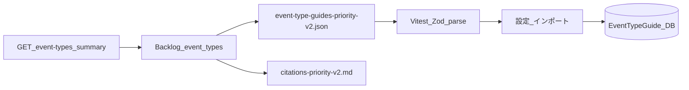

# イベント種別ガイド第2弾（priority v2）Implementation Plan

> **計画書の正本:** 本ファイル（`docs/superpowers/plans/2026-03-22-event-type-guides-priority-v2.md`）。Cursor の `.cursor/plans/` にある同名は作業用のコピーでよい。

> **For agentic workers:** REQUIRED SUB-SKILL: `@superpowers:subagent-driven-development`（推奨）または `@superpowers:executing-plans` でタスク単位に実装。チェックボックス（`- [ ]`）で進捗管理。

**Goal:** [`docs/event-type-guides/README.md`](../../event-type-guides/README.md) に記載の第2弾に向け、**第1弾と同一スキーマ**の追加用シード [`data/seed/event-type-guides-priority-v2.json`](../../../data/seed/event-type-guides-priority-v2.json) と出典表 [`docs/event-type-guides/citations-priority-v2.md`](../../event-type-guides/citations-priority-v2.md) を整備し、Vitest でパース検証しつつ、**バッチ単位**でガイド本文を積み上げる。**priority v2 の `guides` は `v1` と重複しない `vim.event.Event` 下位型のうち、Broadcom vSphere Web Services API 7.0／pyvmomi 9 で列挙可能な範囲を網羅する（現行の上限 **463 件**。500 件などの数値目標は API 上の型数を超えられない）。（進捗は README の件数表記で追跡する。）

**Architecture:** ファイル形式は変更しない（[`eventTypeGuidesFileSchema`](../../../frontend/src/api/schemas.ts) の `format: "vea-event-type-guides"`、`version` は整数 `>= 1` — アプリのエクスポートは現状 `version: 1` 固定）。第2弾 JSON は **第1弾に含まれる `event_type` と重複しない**ことをリポジトリルールとする（単一ファイル内の重複も禁止 — 既存 Zod の `superRefine` と同じ）。

**インポート（追加適用）:** v1 適用済み DB に v2 だけを足す場合、既存行を消さないようリクエストの `delete_guides_not_in_import` は **false**（ファイルに含まれない `event_type` のガイドを DB から削除しない）。上書きが必要なら `overwrite_existing` を **true**。**補足:** [`EventTypeGuidesImportRequest`](../../../src/vcenter_event_assistant/api/schemas.py) の API 既定および設定 UI（[`EventTypeGuidesPanel`](../../../frontend/src/panels/settings/EventTypeGuidesPanel.tsx) のチェックボックス初期値）は、すでに **`overwrite_existing=true` / `delete_guides_not_in_import=false`** である。手動で JSON を組み立てる場合のみ、上記を明示する。

**Tech Stack:** JSON / Markdown（日本語）/ Vitest（シード検証）/ 既存 FastAPI インポート API

**前提（第1弾からの継承）:** 調査手順・要約方針・`action_required` の目安は [README](../../event-type-guides/README.md) どおり。優先度の付け方の骨子は [`priority-list-rationale.md`](../../event-type-guides/priority-list-rationale.md)（**機微情報はコミットしない**）。第1弾の詳細な一次計画は [`2026-03-22-event-type-guides-official-docs-content.md`](./2026-03-22-event-type-guides-official-docs-content.md)。



調査時は出典表と JSON を**同じバッチで**更新する（図では `backlog` から両方へ分岐）。

---

## ファイル構成（新規・変更）

| 役割 | パス |
|------|------|
| 第2弾シード（段階的に肥大化） | 新規 [`data/seed/event-type-guides-priority-v2.json`](../../../data/seed/event-type-guides-priority-v2.json) |
| 第2弾出典表 | 新規 [`docs/event-type-guides/citations-priority-v2.md`](../../event-type-guides/citations-priority-v2.md)（列・体裁は [`citations-priority-v1.md`](../../event-type-guides/citations-priority-v1.md) に合わせる） |
| インポート手順・第2弾の位置づけ | 変更 [`docs/event-type-guides/README.md`](../../event-type-guides/README.md)（v1/v2 の関係、追加インポート時の推奨オプション、**関連ファイル表に v2 の行を追加**） |
| 優先リスト決定メモ | 変更 [`docs/event-type-guides/priority-list-rationale.md`](../../event-type-guides/priority-list-rationale.md) に **「priority v2」** セクション（手順のみ・実データはローカル） |
| シードの Zod 検証 | 変更 [`frontend/src/api/eventTypeGuidesFile.test.ts`](../../../frontend/src/api/eventTypeGuidesFile.test.ts)（v2 用 `describe` を追加） |

**変更しないもの（YAGNI）:** DB モデル、API、Zod スキーマ本体、第1弾シードの内容（第2弾は別ファイルで追加）。コンテンツは **50 件を 1 バッチ**として PR／コミットにまとめる（最終バッチのみ 50 件未満でもよい）。

---

## リポジトリ整合性ルール（第2弾特有）

1. **`guides` 配列内の `event_type` 重複なし**（ファイル内）。
2. **v1 シードに既に存在する `event_type` を v2 に含めない**（追加専用）。修正が v1 の項目に必要なら **v1 JSON を編集**する別タスクとする。
3. JSON のメタデータ例: `format: "vea-event-type-guides"`、`version: 1`（**ファイル形式バージョン**として v1 シードと揃える）、`exportedAt` は更新のたびに最新化してよい。
4. 出典表は **イベント種別ごとに少なくとも1行**（v1 と同様）。未確認は表に「未確認」と書き、JSON は無理に埋めない方針は README どおり。

### v1 と v2 の `event_type` 交差チェック（例）

`jq` が必要（未導入なら `brew install jq` 等）。**出力が空**なら v1 と v2 に共通の `event_type` はない。

```bash
cd "$(git rev-parse --show-toplevel)"
comm -12 \
  <(jq -r '.guides[].event_type' data/seed/event-type-guides-priority-v1.json | sort -u) \
  <(jq -r '.guides[].event_type' data/seed/event-type-guides-priority-v2.json | sort -u)
```

---

### Task 1: 雛形ファイルと README / priority-rationale の更新

**Files:**

- 新規: [`data/seed/event-type-guides-priority-v2.json`](../../../data/seed/event-type-guides-priority-v2.json)
- 新規: [`docs/event-type-guides/citations-priority-v2.md`](../../event-type-guides/citations-priority-v2.md)
- 変更: [`docs/event-type-guides/README.md`](../../event-type-guides/README.md)
- 変更: [`docs/event-type-guides/priority-list-rationale.md`](../../event-type-guides/priority-list-rationale.md)

- [ ] **Step 1:** v2 シードの最小形（`guides: []` 可）を v1 と同じキー構造で置く。

```json
{
  "format": "vea-event-type-guides",
  "version": 1,
  "exportedAt": "2026-03-22T00:00:00.000Z",
  "guides": []
}
```

- [ ] **Step 2:** `citations-priority-v2.md` に v1 と同様の見出し・空の表（またはプレースホルダ1行）を置く。

- [ ] **Step 3:** README に「第2弾」へのリンク、`event-type-guides-priority-v2.json` のインポート例、v1 適用済み DB へ v2 を足すときは `delete_guides_not_in_import: false` とする旨の注意を追記する（API/UI 既定が追加向きであることも一文でよい）。

- [ ] **Step 4:** README の **関連ファイル** 表（または同等の一覧）に、`event-type-guides-priority-v2.json` と `citations-priority-v2.md` の行を追加する。

- [ ] **Step 5:** `priority-list-rationale.md` に「priority v2」節を追加し、`GET /api/event-types` / ダッシュボード要約との突合せ・定番カテゴリ補完・**v1 との差分（新規種別のみ v2 へ）** を1ページで説明する（長い実データは書かない）。

- [ ] **Step 6:** Commit（例: `docs: scaffold event type guides priority v2 seed and citations`）。

---

### Task 2: Vitest — v2 シードのパース検証

**Files:**

- 変更: [`frontend/src/api/eventTypeGuidesFile.test.ts`](../../../frontend/src/api/eventTypeGuidesFile.test.ts)

- [ ] **Step 1:** `describe('data/seed/event-type-guides-priority-v2.json', () => { ... })` を追加し、`eventTypeGuidesFileSchema.parse` が成功することを検証する（v1 のテストと同パターン: `eventTypeGuidesFile.test.ts` の v1 用 `describe` 付近）。

- [ ] **Step 2:** 雛形のみの期間は `guides.length === 0` を許容する。**最初のコンテンツを v2 に入れたバッチと同じ PR** で、`expect(parsed.guides.length).toBeGreaterThan(0)` に切り替える（空シードをコミットし続けない）。

- [ ] **Step 3:** 実行: `cd frontend && npx vitest run src/api/eventTypeGuidesFile.test.ts` — **PASS** を確認。

- [ ] **Step 4:** Commit。

---

### Task 3 以降: コンテンツバッチ（第2弾の本体・繰り返し）

**件数目標:** v2 シードの `guides` を **463 件**（`vim.event.Event` 下位型のうち v1 と重複しないものの、現行 pyvmomi で列挙できる最大数）まで拡張する。途中経過ではバックログまたはカテゴリ補完で埋める。

**バッチのまとめ方:** **1 バッチ = 50 件**を推奨する。1 バッチの作業では、ガイド本文・出典表・`exportedAt`・README の件数表記を **まとめて** 更新し、**1 PR（またはバッチ単位の 1 コミット）** に収める。全件網羅時の一括更新も可。

**Files:**

- 変更: [`data/seed/event-type-guides-priority-v2.json`](../../../data/seed/event-type-guides-priority-v2.json)
- 変更: [`docs/event-type-guides/citations-priority-v2.md`](../../event-type-guides/citations-priority-v2.md)

- [ ] **Step 1:** バックログから `event_type` を選び、Broadcom の **vSphere Web Services API** で `vim.event.*` ページの Data Object Description を確認する（README の調査手順）。

- [ ] **Step 2:** 日本語要約を JSON に追加（`general_meaning` / `typical_causes` / `remediation` / `action_required`）。**v1 の `event_type` と重複しない**ことを、上記の `comm` + `jq` による交差チェックまたは `rg` で確認する。

- [ ] **Step 3:** 同一バッチで `citations-priority-v2.md` に行を追加する。

- [ ] **Step 4:** `npx vitest run src/api/eventTypeGuidesFile.test.ts` — PASS。

- [ ] **Step 5:** （任意）ローカルで API を起動し、設定画面から v2 JSON をインポートし、既存 v1 エントリが残ることを確認する（UI 既定のまま `delete_guides_not_in_import` がオフなら、v2 に含まない既存ガイドは削除されない）。

- [ ] **Step 6:** Commit（**50 件バッチ**ごとに 1 回。最終バッチのみ 50 件未満でもよい）。

**完了の定義（第2弾・priority v2）:** `guides` が **463 件**に達し、残る `vim.event.Event` 下位型が v1 と重複しない範囲でなくなった時点で目標達成とみなす（型の存在確認が取れない `event_type` はスキップし、バックログに残す）。README の関連ファイル表に **現在の v2 シード件数** をメンテする。

---

## 手動検証チェックリスト（API）

- インポート: `POST /api/event-type-guides/import` の body にファイル由来の `guides` を載せる。追加適用では `delete_guides_not_in_import: false`、既存を上書きする場合は `overwrite_existing: true` — 実装は [`event_type_guides.py`](../../../src/vcenter_event_assistant/api/routes/event_type_guides.py) の import ハンドラ。API の既定は上記「Architecture」のとおり **既に追加向き**。
- 既存テスト [`tests/test_event_type_guides_api.py`](../../../tests/test_event_type_guides_api.py) は v1 シードを使用 — **必須変更ではない**。
- （任意）v2 の最小1件を含むファイルで import し件数が増えることだけ確認する pytest を足すのは YAGNI でよい（手動のみでも可）。

---

## plan-document-reviewer 反映（2026-03-22）

Markdown 崩れの修正、チェックボックス形式への統一、`docs/superpowers/plans/` への正本化、README 関連表の明示、v1/v2 交差チェックの具体コマンド、API/UI 既定の明記、Vitest の `guides.length` 期待値の切り替えタイミングの固定、Mermaid の関係（出典と JSON の同時更新）を反映した。

---

## 実装完了後の実行オプション（エージェント向け）

計画承認後、実装は **Subagent-Driven**（タスクごとに新規サブエージェント）か **Inline**（同一セッションで `@superpowers:executing-plans`）を選ぶ。
