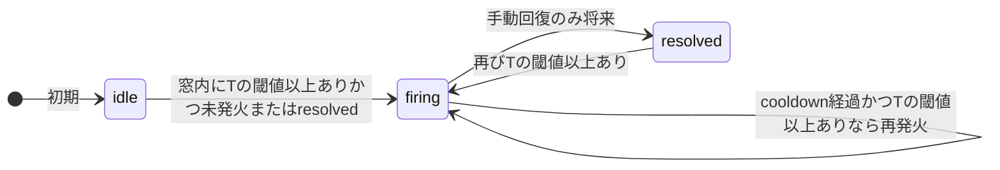

# イベントスコア・アラートのクールダウンと状態管理 — 設計

**Goal:** イベントスコア型アラートの連続発火メールを抑え、イベント種別ごとに状態を追跡する。自動回復は行わず（イベント沈黙は事象解消を保証しない）、手動回復は別フェーズで実装する。

**Architecture:** `_evaluate_event_score` を `(rule_id, event_type)` 単位の評価に変更する。`AlertState` に `last_notified_at` を追加し、再通知は `cooldown_minutes` 間隔で上限1通とする。評価ジョブから `event_score` の自動 `resolved` 遷移を削除する。メトリクス閾値型は変更しない。

**Tech Stack:** Python 3.12+ (SQLAlchemy, APScheduler), Alembic, pytest。ドキュメント・UI 文言は TypeScript (React) を伴う。

**承認:** 2026-05-23（設計レビュー済み）

---

## 背景と問題

### 観測された事象

- 通知履歴で同一イベント種別（例: `vim.event.UserLoginSessionEvent`）が **約2分間隔**で「発火中」として記録される。
- 運用者は **クールダウン10分** で再送が抑止されると期待しがち。

### 現行実装の要点

- [`alert_eval.py`](../../src/vcenter_event_assistant/services/alert_eval.py) の `event_score` は **ルールあたり `AlertState` 1件**。
- **より新しい** 閾値以上イベント（`event_at > fired_at`）で **毎回再発火** 通知。
- **回復** は評価ウィンドウ内に閾値以上が **1件もない** とき、かつ `fired_at` から `cooldown_minutes` 経過後に自動 `resolved`。

### 設計上の誤解

| 運用の期待 | 現行 `cooldown_minutes` の実際 |
|-----------|------------------------------|
| 同種別へのメールは N 分に1通まで | 再通知抑制には **ほぼ効かない**（新しいイベントのたびに再発火） |
| N 分間イベントがなければ回復 | ウィンドウ全体が空でないと回復しない。ログインが続くと **永続 firing** |

---

## 要件（確定）

| ID | 要件 |
|----|------|
| R1 | **イベント種別（`event_type`）ごと**に `AlertState` を独立管理する（Login / Logout は別追跡）。 |
| R2 | **`cooldown_minutes`** はイベントスコア型において **再通知の最小間隔** のみに使う。 |
| R3 | 同一種別が閾値以上で **継続**しても、クールダウン経過までは **再発火メールを送らない**（初回発火を除く）。 |
| R4 | **自動回復しない**。評価ジョブは `event_score` について `resolved` に遷移させない。 |
| R5 | **メトリクス閾値型**は現状維持（最新サンプルが閾値未満なら自動回復）。 |
| R6 | 評価ウィンドウは既存の **`ALERT_EVENT_EVAL_LOOKBACK_HOURS`**（ルール `config` には持たない）。 |
| R7 | 利用者向け [`docs/user-guides/alerts.md`](../../user-guides/alerts.md) を本仕様と同時に更新する。 |
| R8 | **手動回復**は本フェーズでは **実装しない**（仕様・ドキュメントに「別フェーズ予定」と記載）。 |

---

## 非目標（スコープ外）

- 手動回復 API / UI の実装
- `metric_threshold` の挙動変更
- `ALERT_EVENT_EVAL_LOOKBACK_HOURS` の意味・既定値の変更
- 手動 `POST /api/alerts/evaluate` の追加
- タイムライン上の「アラート」表示ロジックの変更

---

## 推奨アプローチ（採用: 案A）

**案A:** 種別ごと複数 `AlertState` + `last_notified_at` 列（採用）

- `metric_threshold` と同様に `(rule_id, context_key)` で状態を分離。
- 再通知間隔を `last_notified_at` で判定（履歴テーブル参照は案Bとして却下）。

**却下した案:**

- **案B:** `alert_history` から最終通知時刻を逆算 — 評価のたびにクエリ、履歴削除で挙動が変わる。
- **案C:** ドキュメントのみ — 連続発火の根本原因が残る。

---

## イベントスコア型 — 評価ロジック

### 入力

- 有効な `AlertRule`（`rule_type == "event_score"`）
- `config`: `threshold`（0–100）, `cooldown_minutes`（≥1、既定 10）
- `window_start = now - ALERT_EVENT_EVAL_LOOKBACK_HOURS`

### 種別集合

評価ウィンドウ内で `notable_score >= threshold` のイベントを **`event_type` でグループ化**し、種別 `T` ごとに:

- `last_qualifying_at = max(occurred_at)`

あわせて、当該 `rule_id` の既存 `AlertState` を `context_key`（= `event_type`）で引く。

### 状態遷移（種別 T）

| # | 条件 | 動作 |
|---|------|------|
| 1 | 窓内に T の閾値以上あり、状態なし or `resolved` | **発火**通知。`state=firing`, `fired_at=last_qualifying_at`, `last_notified_at=now` |
| 2 | `firing`、窓内に T の閾値以上あり、`now - last_notified_at >= cooldown_minutes` | **再発火**通知。`fired_at` / `last_notified_at` 更新 |
| 3 | `firing`、窓内に T の閾値以上あり、上記未満 | **通知なし**。`fired_at`（と必要なら `context_key`）のみ更新可 |
| 4 | `firing`、窓内に T の閾値以上 **なし**（沈黙） | **何もしない**（`firing` 維持、自動回復しない） |

### 削除する挙動

1. ルール単位の単一 `latest_event` による `context_key` の上書き一体管理。
2. `event_at > fired_at` のみでの無条件再通知（現行 L118–122 相当）。
3. `latest_event is None` + cooldown による自動 `resolved` と回復メール（`event_score` 専用分岐の削除）。

### `cooldown_minutes` の利用者向けラベル（推奨）

- UI: 「再通知間隔（分）」など（`config` キー名 `cooldown_minutes` は後方互換のため維持）。
- 説明: 「同じイベント種別が続く場合でも、メールはおおむねこの間隔で1通まで」。

---

## メトリクス閾値型（変更なし）

- ホスト（`entity_moid`）ごとに `AlertState`。
- 閾値超えで発火、閾値未満で **自動回復**（クールダウン不要）。
- 本 spec の変更対象外。利用者向けドキュメントではイベントスコア型との **対比** を明示する。

---

## データモデル

### `alert_states` への追加

| 列 | 型 | 説明 |
|----|-----|------|
| `last_notified_at` | `DateTime(tz)`, nullable | 当該 `(rule_id, context_key)` への最終通知時刻 |

### マイグレーション

1. `last_notified_at` 列を追加。
2. 既存 `firing` 行は **`last_notified_at = fired_at`** でバックフィル（推奨。初回評価での意図しない即再通知を防ぐ）。
3. **`(rule_id, context_key)` に UNIQUE 制約**を追加（重複行がないことを事前確認）。

### `context_key`（イベントスコア）

- 値は **`event_type` 文字列**（メール Resource / 通知履歴「対象」列と一致）。

---

## 手動回復（別フェーズ — 本 spec では未実装）

**理由（R4）:** イベントが一定期間発生しなくても、インフラ上の問題が解消したとは限らない。回復は運用者の明示判断とする。

**次フェーズで検討する項目:**

| 項目 | 候補 |
|------|------|
| 操作 | 通知履歴の行から「回復にする」 |
| API | `POST /api/alerts/states/{id}/resolve` 等 |
| 単位 | `AlertState` 1行（`rule_id` + `event_type`） |
| 通知 | 回復メールの要否（既定 ON 想定） |
| 再発火 | `resolved` 後に同種別が再び閾値以上 → 要件1と同様に初回発火 |

本フェーズのコードでは、評価ジョブが `event_score` の `state` を `resolved` に書き換えないことのみを保証する。

---

## 利用者向けドキュメント（[`docs/user-guides/alerts.md`](../../user-guides/alerts.md)）

実装 PR と **同一マージ** で更新する。正本は利用者ガイド + 画面表示。

### 改訂概要

| 箇所 | 改訂内容 |
|------|----------|
| §4 | イベントスコアは **種別ごと**に発火状態を追跡 |
| §5 | 再通知は **間隔（クールダウン）** のみ。自動回復 **なし** |
| §5 vs メトリクス | 対比表（メトリクスは自動回復あり） |
| §8 | 連続「発火中」は間隔通知であり必ずしも新規障害ではない。回復済みが出ない場合は手動回復 **予定** |

### 利用者向け — クールダウンの定義（コピー用）

> **イベントスコア型の「クールダウン（分）」** は、**同じイベント種別**へのメール再送の最小間隔です。  
> イベントがしばらく出なくなっても **自動では回復しません**。調査完了後の回復操作は今後の機能追加で対応予定です。  
> **メトリクス型** は従来どおり、計測値が閾値を下回ると自動で回復します。

---

## 開発者向けドキュメント

- [`docs/backend.md`](../../backend.md) §2.4 の `event_score` 節を本 spec に合わせて更新する。
- 自動回復削除・種別独立・`last_notified_at` を記載する。

---

## テスト方針

| # | シナリオ | 期待 |
|---|----------|------|
| T1 | 同一種別、2分間隔、クールダウン10分 | 10分あたり発火系通知 **最大2回**（初回 + 10分後の再通知1回まで） |
| T2 | Login 継続中に Logout が初めて閾値以上 | Logout のみ新規発火。Login はクールダウン内なら再送なし |
| T3 | 種別 T が沈黙（窓内に閾値以上なし）、`firing` 既存 | **`firing` のまま**、回復通知 **0** |
| T4 | lookback 外のみ高スコア | 発火・回復ともにしない（既存ウィンドウテストの延長） |
| T5 | `cooldown` 経過後も T の閾値以上が続く | 再発火 **1回** |

**変更する既存テスト:**

- `test_evaluate_event_score_resolves_when_no_qualifying_in_window` — 削除または「resolved しない」期待に変更。
- `test_evaluate_event_score_renotifies_on_second_newer_event` — 間隔付き再通知の期待に合わせて改修。

---

## 既存デプロイへの影響

- マイグレーション後、初回評価で `last_notified_at` が NULL の行は再通知されうる → **バックフィル推奨**。
- 自動回復が止まるため、長期間イベントが来ない種別は **通知履歴上「発火中」のまま**残る（手動回復まで）。利用者ガイドで明示する。
- メール件名・`context_key`（`event_type`）の形式は維持。

---

## 実装時の主要ファイル

| ファイル | 変更 |
|----------|------|
| `alembic/versions/...` | `last_notified_at`、UNIQUE、バックフィル |
| `src/vcenter_event_assistant/db/models.py` | `AlertState.last_notified_at` |
| `src/vcenter_event_assistant/services/alert_eval.py` | `_evaluate_event_score` 種別ループ化、自動回復削除 |
| `src/vcenter_event_assistant/services/alert_eval_event_score_config.py` | 種別集約ヘルパ（必要なら） |
| `tests/test_alert_eval_events.py` | 上記 T1–T5 |
| `docs/user-guides/alerts.md` | 必須 |
| `docs/backend.md` | §2.4 |
| `frontend/src/panels/settings/AlertRulesPanel.tsx` | 再通知間隔の hint（推奨） |

---

## 次のステップ

1. 本 spec のレビュー（利用者向け節を含む）
2. `writing-plans` スキルで実装プラン作成（`## Git / ブランチ方針`、[スニペット](../../snippets/git-branch-policy-for-plans.md) 準拠）
3. 推奨ブランチ: `feature/event-score-cooldown`、ワークツリー: `.worktrees/feature-event-score-cooldown/`

---

## 関連ドキュメント

- [2026-04-23-alert-notification-design.md](../../plans/2026-04-23-alert-notification-design.md) — 当初の `context_key` 複数状態の想定
- [2026-05-22-event-score-alert-fix.md](../plans/2026-05-22-event-score-alert-fix.md) — 評価ウィンドウ・再通知（本 spec で再通知・回復方針を上書き）
- [user-guides/alerts.md](../../user-guides/alerts.md) — 利用者向け正本
